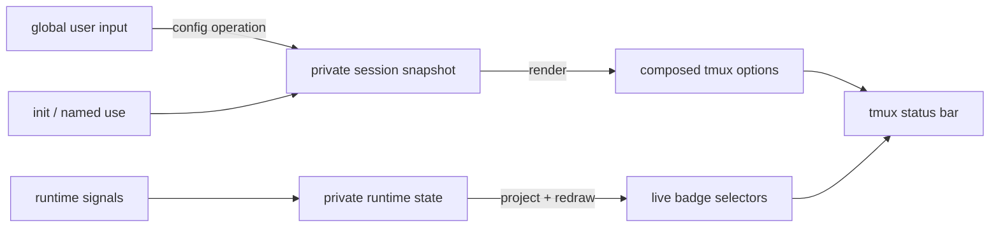

# tmux-airline — Design

This document defines the settled architecture, state model, and public command
grammar. Implementation details belong in the source and tests unless they protect
a non-obvious boundary described here.

The [project philosophy](docs/philosophy.md) defines the platform-first posture
shared by all domains. Focused design documents own the detailed semantics of
individual domains:

- [Signal lifecycles](docs/lifecycle-signals.md) defines the meaning, identity, and
  state transitions of status, health, and problem signals.
- [Runner element contracts](docs/runner-elements.md) defines what Airline supplies to
  a classifier, filter, or probe, what each returns, and which parts of an invocation
  belong to Airline rather than to the element.

## Principles

1. **State is split by ownership.** Public `@airline-*` options are the user-facing
   configuration contract. Private `@airline--*` options are runtime state written
   only by airline. Native tmux options are derived output.
2. **There is one composition path.** `render`, invoked by `apply`, is the only code
   that composes the bar. Runtime signals may update live selectors and redraw, but
   they never construct an alternative bar.
3. **The middle is logic.** Badge reduction, segment assembly, render expressions,
   and palette application use domain terms and do not call the `tmux` binary.
4. **Dependencies point down.** `airline.sh` owns grammar and delegates once into
   `lib/`; internal modules call public functions in lower layers directly, and
   application tmux calls end in `lib/tmux.sh`. The graph is acyclic without
   prescribing every individual cross-module edge.
5. **Validate at the boundary; trust the interior.** CLI behavior handlers validate
   input once. Store and composition functions operate on validated values.
6. **Enforce architecture at build time.** Bash has no useful visibility boundary,
   so lightweight lint rules enforce layering without adding runtime machinery.
7. **Lifecycle operations are idempotent and redraw-gated.** Re-running `init` must
   not clobber established session choices, and rendering unchanged output must not
   refresh the client.
8. **Observe at the richest available boundary.** Interactive programs that expose
   lifecycle callbacks publish status and health through the signal API directly.
   Airline's runner is the lower-fidelity floor for non-interactive lifecycles: it
   owns command launch or probe-only watching and delegates domain interpretation
   to independently registered classifier, filter, and probe elements.

## Architecture

| File | Responsibility | Direct `tmux` calls? |
|------|----------------|:-------------------:|
| `airline.tmux` | TPM / `run-shell` entry point; invokes `airline.sh session init` | no |
| `airline` | Installable PATH shim; resolves the active CLI through `@airline-cli` | bootstrap lookup only |
| `airline.sh` | Public CLI: parses the grammar and delegates each command once | no |
| `lib/help.sh` | Renders marked CLI grammar sections for help and completions | no |
| `lib/command.sh` | Shared CLI error, context, and output helpers | no |
| `lib/session.sh` | Session bootstrap, configuration coordination, and state | no |
| `lib/transaction.sh` | Transaction-marker inspection and stale recovery | no |
| `lib/signal.sh` | Status, health, problems, projection, and observation cleanup | no |
| `lib/catalog.sh` | Owns registered search paths and bare-name resolution | no |
| `lib/layout.sh` | Palette, widget, segment, and executable-layout behavior | no |
| `lib/runner.sh` | Runner contracts, mechanics, and orchestration | no |
| `lib/render.sh` | Owns domain vocabulary and composes the bar | no |
| `lib/collections.sh` | Stores and reduces variable-cardinality state | no |
| `lib/tmux.sh` | Mechanical operations and airline namespace policy | **yes; sole application caller** |
| `layouts/palettes/*` | Declarative public color configuration | evaluated by `lib/layout.sh` |
| `lib/widget.sh` | Widget format validation, argument resolution, and instance retirement | no |
| `layouts/widgets/*` | Flat widget `.sh` format definitions and optional scalar executables | no |
| `layouts/definitions/*` | Trusted Bash definitions declaring widgets and segments | no |
| `runners/classifiers/*` | Interprets process termination | no |
| `runners/filters/*` | Interprets a copied command-output stream | no |
| `runners/probes/*` | Performs one bounded external observation | no |
| `runners/definitions/*` | Names a run or watch composition | no |


A tmux hook or a newly created pane
starts a fresh Bash process and therefore enters through `airline.sh`, which owns
library loading, environment setup, argument validation, and dispatch. Most such
entry points use the public grammar. The result-observation hook instead uses one
explicitly private verb because invoking it correctly requires Airline's private
pane revision; it still crosses the normal CLI loading and validation boundary.
Once loaded, modules call one another directly: a
non-underscore function is a module service, while an underscore-prefixed function
is private to the file that defines it. Because every library is sourced into one
Bash function namespace, public service names must also be unique across modules;
the dependency lint rejects source-order overrides.

Build-time dependency enforcement uses the following coarse layers rather than an
allowlist of every permitted pair. Calls must point to a strictly lower layer;
`command` is a shared validation/context helper callable by every layer and itself
depends only on the mechanical context-resolution boundary.

```text
airline
  session / transaction / help
  layout
  widget / runner
  signal
  catalog / render
  collections
  tmux
```

The important boundaries are:

- Within the application layers, only `lib/tmux.sh` invokes the `tmux` binary or spells
  private `@airline--` names. The installable PATH shim is an external
  consumer: like a plugin, it makes one bootstrap lookup of `@airline-cli`. Higher
  layers address airline options by bare key through `pub_*` and `prv_*` accessors.
- Layouts are trusted Bash definitions, not loaded application layers. Their required
  `airline_layout_configure` function declares segments and widgets through a core
  callback. They never receive a tmux handle, target session, or private-state access.
- `lib/collections.sh` is an airline abstraction above tmux's flat option store. It is
  used for dynamic signal claims, layout/widget membership, registered search paths,
  and live runner process records.
  Fixed segment slots are scalar options, not collections. Its operations take
  `global`, `session`, or `window` as their first argument and the native owner as
  their second; namespace, tuple contents, and reduction order are caller policy.
- `lib/catalog.sh` owns the common trust and lookup mechanism for every registered
  element kind. Layout and runner own element behavior but use catalog's public
  register, resolve, list, and path operations; they do not know the path collection
  namespace or representation.
- `lib/signal.sh` owns runtime status, health, and problem reporting: validation,
  collection mutation, badge projection, redraw gating, and transient consumption.
  All three signals follow the same mutation pipeline, with lifecycle policy kept
  in signal-specific callbacks. A problem is a server-global failure of airline or
  a contributor to provide an advertised capability; it is not window or pane
  attention. Layout and runner report managed problems through that public service.
- Palette and layout are independent axes: a palette chooses colors; a layout
  chooses ordered widget and literal formats. Palette changes publish live session
  roles without rerunning layouts or executing widget runtime commands.

## Widgets and public palette

The [widget contract](docs/widget-contract.md) and [runtime guide](docs/widgets.md)
define the widget and catalog format. Palette roles are stable public session options
holding effective display colors. Palette and widget details belong to those focused
documents; this design retains only their ownership consequences.

## State model

State falls into four kinds:

| Kind | Written by | Examples |
|------|------------|----------|
| **Public options** `@airline-*` | Airline per session; users for defaults/edits | effective palette, configuration input, `@airline-cli` |
| **Private options** `@airline--*` | airline at runtime | committed config, signals, badges, selections, paths |
| **Composed output** | `render` | `status-left/right`, window formats, styles, pane borders, clock color |
| **Constants** | source code only | glyphs, chevrons, name template, vocabularies, precedence tables |

The classification is mechanical:

- A value is an option when something outside `render` writes it. A fixed value
  used only while rendering is a Bash constant.
- Public versus private is a contract boundary. Users may set `@airline-*` and may
  read the public session palette and `@airline-cli` bootstrap handle; other managed
  state, including the version, is read through the CLI.
- Private option names, tuple shapes, and other encodings are implementation details
  with no compatibility guarantee. Code that reads or writes `@airline--*` directly
  bypasses the public CLI contract; Airline may replace or clear that state without
  providing a migration path.
- Native tmux output is derived. Users configure the public inputs, not
  `status-left`, `window-status-format`, or the other rendered snapshots.

### Scope and inheritance

Global palette options seed new sessions; initialized sessions publish complete local
palettes. `session apply` captures local edits that differ from the last published
display colors, preserving the unsuspended restoration values. Global segment inputs
still patch the invoking session on apply, retiring only the replaced slot's widgets.
Palette files are evaluated under private staging names; layout declarations are
collected in Bash before commit.

Named palette/layout operations replace their complete axis and record provenance.
Manual role/segment patches clear the corresponding selection. Unsetting a public
role republishes the saved value on apply; selecting a palette restores its definition.

Private state exists at its native owner:

- status entries are window-scoped and keyed by pane; health claims are pane-scoped;
  both projected badges are window-scoped;
- the problem ledger, origin claims, and projected problem badge are server-global;
- palette/layout selections, guards, paths, suspension, committed configuration,
  and widget instances are session-scoped.

Window formats and styles are native window options. A session target sets them
only on that session's current window; it does not establish session defaults.
Render installs them on every existing window and saves private session snapshots
for the new-window hook. The hook copies those snapshots without expanding their
live selectors. Inactive names inherit tmux's window style when no mode is active,
so previous-window emphasis and activity/bell colors remain visible. Mode colors
fill inactive window backgrounds; the active window retains its normal foreground
and highlight background for readability.

### Apply and live updates

The private session snapshot retains restoration colors and composed formats. Apply
captures public edits and renders, publishing effective palette values. It does not
rerun a layout script or execute widget runtime commands; tmux evaluates those on its
normal status refresh.



The two update modes are deliberately different:

- Configuration changes move values that must be baked into the output. A direct
  `set -g @airline-*` stages a change; `apply` commits and renders it. Named `use`
  operations first consume pending global input, then replace and record their own
  axis. Thus a pending color followed by `layout use` clears palette provenance while
  still recording the selected layout.
- Runtime `status`, `health`, and `problem` changes update their collections,
  project a scalar badge value, and redraw. The already-composed selector follows
  the scalar, so no apply is needed.

`init` publishes `@airline-cli`, installs missing default palette and layout
selections behind a session sentinel, and renders. Re-running it does not overwrite
an existing session selection. Initialization then sources the optional user command
file through `session config`. A global `after-new-session` hook initializes future
sessions using an explicit session target. Because tmux has global defaults but no
session defaults for window options, an `after-new-window` hook copies the creating
session's committed palette roles directly into the new window's pane-border and
clock options without starting another Airline process.

`VERSION` is the sole release-version source. The read-only `airline version`
command returns its value; `scripts/release` derives the annotated Git tag from it;
and the tag-triggered GitHub workflow refuses to publish unless the tag is exactly
`v<VERSION>`. The workflow creates the GitHub release from that verified tag, so the
runtime contract, repository tag, and release name cannot be supplied independently.

### Render boundary

The status bar contains three kinds of value:

1. **Baked constants.** Palette colors, chrome, chevrons, and styles
   change when the configuration is rendered. Widgets also read public palette roles live.
2. **Live selectors.** Tmux `#{?…}` expressions select among baked colors for status,
   health, problem, zoom, copy mode, and activity. The choice is reevaluated by tmux;
   the branch colors were baked by airline.
3. **Live readings.** Plugin values such as external readings and tmux values such as the
   clock remain `#{…}` references and update on the normal status interval.

The rule is: **colors are baked; selectors and readings are live.** `apply` renders
only what must be baked.

Rendered output is written at its native tmux owner. Status bars, window-list
formats, and their styles are session options. Pane-border styles and clock color
are window options, so render updates every window in the target session and the
new-window hook initializes future windows. No palette-derived output is written to
tmux's global session or global window defaults. A tmux window linked into multiple
sessions remains one native window and therefore has one set of window-owned pane
and clock options; this is tmux ownership rather than Airline state leakage.

## Configuration kinds

There are seven catalog kinds and one plain-option kind:

| Kind | Representation | Lifecycle |
|------|----------------|-----------|
| **palette** | complete targetless tmux config containing public color options | `use` captures one file, replaces colors, records it, then renders |
| **widget** | Stateless Bash format definition with an optional scalar runtime executable | placed through a layout; evaluated by tmux on status refresh |
| **layout** | Bash function declaring widget and literal fragments through a callback | `use` or `load` validates once, replaces that axis, records it, then renders |
| **classifier** | trusted shell mapping process termination to a condition | selected by `runner run` |
| **filter** | trusted shell interpreting a copied command-output stream | selected by `runner run` |
| **probe** | trusted shell performing one bounded observation | selected by `runner run` or `watch` |
| **runner** | named run/watch composition over those primitives | expanded for one invocation |
| **segment** | public `@airline-segment-<slot>` option | set directly or by a layout; not loadable |

All seven catalogs share search paths, marked header metadata, and `describe`.
See [Catalogs and discovery](docs/catalogs.md) for ownership and the metadata contract.

Catalog registration prepends a trusted search path. List reads names and metadata;
describe performs domain-specific inspection. Palette and layout use/load replace
an axis, recording the name or absolute path. Widgets activate through layout
placements, with preserved argument boundaries and per-fragment identities.

Configuration transactions serialize each session's publication. Layout callbacks
accept `segment <slot> <format>`, `widget <slot> <name> [arguments...]`, and
`widget-optional <slot> <name> [arguments...]`. Only optional availability may omit a
widget; invalid declarations reject the candidate. Repeated slots append. Widgets
may set local styles; conforming widget fragments restore the supplied segment `fg`
and `bg` before they end. Format construction does not observe or mutate tmux.

## CLI contract

`airline.sh` is the public parser and dispatcher. Each successful command arm makes
exactly one implementation call; context resolution, sequencing, state access, and
rendering stay behind that boundary. The `airline` executable is only the installable
discovery shim that resolves the active `airline.sh` through `@airline-cli`.
Argument roles and canonical ordering are defined in
[CLI conventions](docs/cli.md).

### Grammar

```text
airline session init [-t <session-target>] [<file>]
airline session apply
airline session show [state]
airline session suspend | resume | toggle
airline version
airline help [<noun> [<verb>]]

airline status   set [-t <pane-target>] <active|result|attention>
                 clear [-t <pane-target>]
                 show [-t <window-target>]
airline health   set [-t <pane-target>] <contributor> <health-key> <ok|warn|fail> [<message>...]
                 ack [-t <pane-target>] <contributor> <health-key>
                 clear [-t <pane-target>] <contributor> <health-key>
                 show [--all] [-t <pane-target>] [<contributor> [<health-key>]]
airline problem  set [-t <pane-target>] <contributor> <problem-key> <ok|warn|fail> [<message>...]
                 close [-t <pane-target>|--session <session-target>] [<contributor> [<problem-key>]]
                 ack <contributor> <problem-key>
                 clear <contributor> <problem-key>
                 resolve <contributor> <problem-key>
                 show [--all|--level] [<contributor> [<problem-key>]]
airline transaction show
                    clear <global|session|window> <target> <namespace>

airline palette  describe <palette> | show [name|<palette-element>] | list | use <palette> | load <file> | register <dir>
airline segment  show [<segment>]
airline widget   describe <widget> [<arg>...] | list | register <dir>
airline layout   describe <layout> | show [name|path] | list | use <layout> | load <file> | register <dir>
airline classifier describe <classifier> | list | register <dir>
airline filter     describe <filter> | list | register <dir>
airline probe      describe <probe> | list | register <dir>
airline runner   describe <runner> [<arg>...] | list | register <dir>
                 run [--pane [-h|-v]|--window] <runner> [<arg>...] [-- <command>...]
                 run [--pane [-h|-v]|--window] [--classify <classifier> [<arg>...]]
                     [--filter <filter> [<arg>...]] [--merge-stderr] [--interval <seconds>] [--probe <probe> [<arg>...]] [-- <command>...]
                 watch [--pane [-h|-v]|--window] <runner> [<arg>...]
                 watch [--pane [-h|-v]|--window] --probe <probe> [<arg>...]
airline process  list | show <process-id> | stop <process-id>
```

All listed commands are public. Tmux hooks use those operations when the event has a
public meaning. Result observation is the narrow exception: Airline's hook invokes
the unlisted `status _observed-result <pane> <revision>` entry point because its
revision is private implementation state rather than caller input. Spawned runner
command panes and windows re-enter through the public `runner run` command,
whose omitted placement means the current pane; process-local spawn context arms
pane retention before validation without adding
public command grammar.

The process exit contract is binary for callers that only need success or failure:
zero means a valid request completed, including an idempotent no-op. The detailed
command and signal status meanings are owned by [CLI conventions](docs/cli.md).

The parser arms are also the grammar source. Explicit `help:begin` / `help:end`
markers delimit each noun without depending on function or `case` formatting;
colocated `#|` annotations contain usage and descriptions. `lib/help.sh` renders
those annotations directly. Semantic placeholders such as `<palette>`, `<layout>`,
`<file>`, and `<window>` are part of that contract: they tell completion generation
which catalog or shell primitive supplies a value.

Bash and Zsh completions are compiled from the structured grammar records emitted by
`airline help _grammar` and sourced from the same parser annotations. They do not add
a runtime inspection API or parse `airline.sh` independently. `make completions` updates the committed artifacts,
and `make check-completions` rejects drift. `make install` performs that check and
installs both artifacts with the PATH shim.

### Conventions

- `apply` is whole-system because there is one render over the complete source of
  truth. There are no per-noun apply commands.
- `set`, `ack`, and `clear` belong to dynamic signal nouns. Palette elements are public session options; segment overrides are global inputs.
- Stateful nouns use bare `show` for a labeled human summary and qualified fields
  for raw scripting reads. Catalog-only classifier, filter, probe, and runner use
  `describe <name>` to describe one resolvable implementation.
- `palette show name` and `layout show name` expose their active selection. Layout
  also exposes its resolved path.
- Widgets appear in `session show`; `widget describe` constructs their formats without
  observing. `widget list` discovers available definitions.
- Runner elements compose only for one invocation. A leading bare runner name
  expands a catalogued composition; an option-leading invocation remains ad hoc.
  Named compositions contain monitoring configuration but never the command.
  `run` defaults to classifier `conventional`; `watch` requires a probe. Omitting placement
  uses the current pane, while `--pane` and `--window` create tmux topology
  through the common runner core. Pane placement accepts tmux's native `-h` and
  `-v` orientation modifiers; omitting one preserves tmux's default split.
- Status mutation and health resolve pane targets, while status inspection resolves
  a window target. Health places `-t <pane-target>` before its keyed tuple so
  every trailing message word is opaque. Problems are globally visible.
  Health and problem take contributor and claim as separate identity fields.
  `problem set` attributes a claim to the current pane; `-t` selects another pane.
  Core configuration reports retain session origins. Lifecycle hooks close claims
  for destroyed origins. Health and
  problem require a user-facing message for `warn` and `fail`; `ok` is message-free
  reporter recovery. For health it removes the condition; for problem it removes
  one origin claim and records `resolved` history when the final claim recovers.
- Session state is the active/suspended axis. Suspension derives a muted palette and
  traps the prefix; airline itself installs no key binding. `session show state`
  returns its raw scripting value.

Static options deliberately retain normal tmux behavior: changing a value at
runtime requires `set -g …` followed by `apply`, and an unknown option name is not
validated. This keeps configuration readable and composable with tmux instead of
adding a parallel configuration API.

## Process runner

The runner is airline's floor for non-interactive lifecycles. Interactive programs
such as coding agents expose richer lifecycle callbacks and should call the public
`status` and `health` API directly; wrapping them in a runner would discard useful
information only to reconstruct it. Airline can either launch a process with `run`
or own a probe-only observation lifecycle with `watch`. The latter makes a remote,
independently managed service observable without inventing a null local job.

The runner separates fixed mechanics from program-specific interpretation:

| Owner | Responsibility |
|-------|----------------|
| **airline core** | select placement, own the run/watch lifecycle, preserve command I/O, retain spawned panes/windows, project its own status and command outcome, report orchestration failures, and return a run child's exit status |
| **runner elements** | independently classify termination, interpret a stream, or probe external state |
| **command** | when using `run`, perform the work and explain itself through its normal terminal output |

Classifier, filter, and probe are first-class catalogs. Each implementation declares
a one-line summary in a `#|` header comment; probes also declare their argument usage
and an optional observation interval. Airline reads those declarations without
executing the file, so `describe <name>` exposes metadata and the resolved path without
running an observation. Inspection reports what an element declares; `run` and
`watch` verify that it behaves.

The declared interval is the probe's default pace, not a fixed property. A named
composition may override it with `configure interval`, and an invocation overrides
both with `--interval`; the element's declaration is the fallback.

A runner catalog entry is syntactic composition over those primitives:

```bash
#| summary: Monitor a TAP-producing test command
#| usage:

airline_runner_configure() { # <configure-function> [<runner-arg>...]
  local configure="$1"; shift
  "$configure" classify conventional
  "$configure" filter tap
}
```

The configure function calls a core-owned callback; stdout is not its protocol.
Metadata remains in the shared `#|` headers. See
[runner element arguments](docs/runner-elements.md#arguments-and-named-compositions)
for configure declarations, argument boundaries, and reserved tokens.

The result is one complete monitoring composition. `run` consumes classifier,
filter, and probe; `watch` projects the probe and fails when none was configured.
Placement belongs exclusively to the `run`/`watch` invocation and is never part of
a catalog entry. There is no runner mode declaration or separate watcher protocol. The
catalog stores monitoring policy only: commands, working directories, environment
setup, scheduling, retries, and restart policy do not belong in a runner definition.

```sh
airline runner run tap -- bats --formatter tap test/
airline runner watch http http://localhost/health
```

There is no active runner selection. A named definition configures one invocation
and then uses exactly the same validation and lifecycle path as inline composition.

Airline does not prepare or rewrite the command and does not describe its result.
An executable that cannot launch already writes the authoritative error and exits
nonzero; a program such as a test suite already produces a richer explanation than
airline could. In the current pane that output remains in the shell's terminal. A
new pane or window is retained after completion so its output and tmux's native dead
pane status remain available until the user dismisses it. Retention is common
launcher policy, not an implementation hook.

### Active processes

`runner` owns selection, validation, and launch. `process list`, `process show`, and
`process stop` manage live invocations using opaque IDs distinct from OS PIDs.
This control surface exists for detached `watch` invocations; `run` participates
for symmetry even though its foreground lifecycle does not require it. `run` holds
foreground streams for a command or repeated probe; `watch` starts the probe in the
background with all terminal streams connected to `/dev/null` and
returns its process ID. The owning pane remains usable. Closing it cancels its work.

Runner stores server-scoped process records and stop requests through collections
under the process transaction. PID registration and removal acquire that same lock
before reading the tuple and hold it through publication, so supervisor and worker
updates cannot overwrite one another or a stop request. Waiting for processes and
publishing signals happen outside this lock. Signal stores per-pane invocation membership and
changes aggregate pane status under one window status transaction, preserving
`active` until the last invocation ends. Supervisors own cancellation and retire
their records after cleanup; element-owned health recovery remains separate.
No restart service or completed-process history is provided.

Unix pipes/FIFOs and `tee` copy output; OS backpressure applies and no command output
is spilled to disk. Separate stdout/stderr pumps preserve destinations, with no
cross-stream ordering guarantee. See the [Bash contract](docs/runner-elements.md).

### Classification

Every run has one terminal classifier; `conventional` is implicit unless another is named.
It receives the command's shell wait status once and returns no verdict or one
validated condition: `ok`, `warn`, or `fail`. The shipped `conventional` classifier maps exit zero to
`ok` and every other command exit to `fail`. Airline-controlled cancellation leaves no
verdict. A shell status cannot distinguish a signal termination from an explicit
`exit 130` or `exit 143`, so both are ordinary nonzero command outcomes. `none` is the
explicit no-verdict classifier. Probe-only invocations have
no command termination to classify. A program-specific implementation
exists only where that program assigns richer meaning to termination, such as a
dedicated exit code for "no tests collected" that should be `warn` rather than
`fail`.

Airline owns lifecycle status. Runner elements remain tmux-independent and report
normalized observations that core projects onto health:

| Process state | Classifier result | Runner status | Classifier health |
|---------------|-------------------|---------------|-------------------|
| running | not yet observed | `active` | clear |
| exited | `ok` | `result` | clear |
| exited | `warn` | `result` | `warn` + diagnostic |
| exited | `fail` | `result` | `fail` + diagnostic |

The classifier is terminal and one-shot. It does not launch processes, mutate tmux,
or write airline signals. It supplies the user-facing diagnostic for a retained
`warn` or `fail` condition. Airline returns the child's original exit status rather
than replacing it with the classification.
The concrete trusted-shell contract is:

```bash
#| summary: Interpret this program termination

airline_runner_classify() { # <exit-status> <signal>
  # Print `ok` or `<warn|fail><TAB><message>`.
}
```

### Live observation

Filters observe a copy of command stdout (or merged stderr); probes perform bounded
queries sequentially until the command ends or a watch is interrupted. Probe stdout
bypasses the filter and is visible under `run`, discarded under `watch`. A watch has no child
command to classify; its status clears on interruption.

Both element kinds receive health and problem function names. Those bind pane context
and call the same signal mutation functions as the CLI, without starting another
Airline command graph. Authors own contributor names, keys, and recovery; core owns
scheduling, command status, and separate execution diagnostics. Silence is valid,
and stopping a runner does not recover contributor claims.

See [runner element contracts](docs/runner-elements.md) for signatures, reporting
semantics, and shipped contributor policies. A command failure remains a job result;
Airline does not copy command diagnostics into problems.

## Collections and badge projection

Status holds one pane-identified entry in a window collection. Each pane owns a
health collection whose claims are reduced into its containing window's badge.
Problem uses a server-global lifecycle ledger plus a server-global set of active
origin claims.
Each collection uses an explicit registry and a tuple per member:

```text
@airline--<namespace>       space-delimited member registry
@airline--<namespace>-<key> tab-delimited fixed-arity tuple
```

Collection rules:

- Every operation has one scope-first form, such as
  `coll_reduce <global|session|window> <owner> <namespace> <order>`. There are no
  scope-specific collection functions. The collection layer passes scope through
  mechanically and does not decide which domain belongs at which scope. Owner
  tuples have one canonical representation: `(global, server)`, `(session, id)`,
  `(window, id)`, or `(pane, id)`.
- Membership is explicit; entries are never discovered by parsing option names.
- `set` writes the entire tuple and registers the key. `unregister` also removes the
  tuple.
- Public identity fields are opaque and cannot contain whitespace or `:`. Status is
  identified by pane and its window collection tuples hold
  `<level>\t<pane-revision>`. Its monotonic counter is a pane-scoped private scalar,
  so it survives status deletion. Pane-scoped health tuples hold
  `<badge|none>\t<active|acknowledged>\t<level>\t<message>`. Problem ledger tuples
  hold
  `<badge|none>\t<active|acknowledged|closed|resolved>\t<last-level>\t<last-message>`;
  active claim tuples hold
  `<contributor>\t<key>\t<pane|session>\t<origin>\t<level>\t<message>`. Health and
  problem use a private composite collection member derived from contributor and key.
  Diagnostic messages may contain spaces but not tabs.
- Storage is never rendered directly. A domain-specific caller reduces the
  collection and projects the result to `badge-status`, `badge-health`, or
  `badge-problem`.
- Reduction receives its ranking as data, keeping `lib/collections.sh` free of status,
  health, and problem semantics.

Health and problem share the ladder `ok < warn < fail`. `ok` or absence is normal
and invisible; `warn` maps to `alert`; `fail` maps to `stress`. Every retained
condition includes a diagnostic message. Messages are opaque user-facing payload:
Airline validates framing, stores and shows the text, but assigns it no meaning.
Reporters and classifier/filter/probe implementations own the diagnostic content.

### Signal lifecycle boundary

Signal meaning, identity, and state transitions are defined in
[Signal lifecycles](docs/lifecycle-signals.md). This document retains only the
architectural consequences: status is keyed by pane within a window, health is keyed by
contributor and claim within its pane owner, and problem is keyed by contributor and claim
globally while retaining pane or session origins.

All three signals use one orchestration path: resolve the native owner, enter its
transaction, apply domain lifecycle policy, reduce/project the collection, and
redraw only when presentation changed. The common path does not make their lifecycle
policies interchangeable.

Dynamic collection operations run in projection-owner transactions: status and health
serialize by `(window, namespace)` even though health writes pane-owned state, while problems serialize by the single
`(global, server, problem)` owner. The registry, member tuple, reduction, and
projected badge therefore form one logical mutation even when background
evaluations overlap.
Status revision changes are staged in the same window transaction as the pane's
collection tuple. Setting `result` installs Airline's observation hook; contributors
do not handle its tokens. The hook invokes the private `_observed-result` process
entry point with `(pane, revision)`, which deletes only an exact current result and
prevents delayed focus cleanup from clearing newer pane state.
`lib/tmux.sh` owns acquisition, an atomic owner-scoped marker, cleanup, stale-owner
detection, and recovery. Transaction callbacks run in a subshell so transaction-local
signal traps do not alter caller traps. `airline transaction show` exposes
outstanding markers, and `transaction clear` releases only a marker whose recorded
process is no longer alive. This diagnostic API is deliberately separate from problems, avoiding a
circular dependency when the problem transaction itself is stuck. Identical problem
sets and absent clears skip both storage writes and redraws. Layout application records
widget capability outcomes and publishes them after its configuration transaction;
inspection does not publish claims. Retiring a widget closes its capability claim.

Status and health are distinguished by position around the window name, so sharing
palette roles is safe.

## Mechanical boundary

`lib/tmux.sh` is the sole integration point with tmux. Its interface follows these
conventions:

- Functions use fixed positional arguments. The generic collection bridge takes
  scope and canonical owner first; `tmux.sh` validates that tuple and translates it
  to tmux flags in one place. In particular, `(global, server)` maps to `-g` without
  inventing an empty owner. Scalar domain accessors may express their fixed owner in
  names such as `prv_set_window`.
- Getters write to stdout or take a caller-selected destination as their first
  argument (`opt_get_into`, `coll_get_into`, `coll_members_into`). Destination reads
  keep workspace access in the calling shell, avoiding command-substitution forks
  and retaining lazily loaded scopes. Predicates use exit status; mutators are silent.
- Session-, window-, and pane-scoped functions take explicit targets. Callers resolve an
  omitted target once and pass the resulting id downward.
- `opt_*` handles native option mechanics; `pub_*` and `prv_*` add airline namespace
  policy; standalone wrappers cover redraw, session-targeted palette sourcing,
  target resolution, hooks, and runner pane/window placement.
- `setif` uses ordinary success/failure status and writes changed-versus-unchanged to
  a caller-selected Bash variable. Orchestration accumulates that private result and
  redraws once only when rendered output changed; a successful no-op cannot mask or
  resemble a failed tmux mutation.

Owner-scoped transactions execute option work against a mutable in-memory
workspace. After acquiring the lock, `tmux.sh` bulk-loads the global option tables
and the transaction owner's session or window table. Additional native owners, such
as the panes holding status revisions or windows receiving one session's rendered
styles, are loaded lazily on first access. Snapshot values remain serialized until
read or mutated; only accessed options need decoding and baseline bookkeeping.
This retains native and third-party options without eagerly parsing their values.
Shipped catalog paths are registered inside the initialization configuration
transaction, sharing its session snapshot. Scalar accessors read and update the desired snapshot with
read-your-writes behavior; presence is tracked separately so unset and explicitly
empty remain distinct. At the end, the mechanical layer compares desired state with
the baseline and submits the ordered final writes as one tmux command sequence.
Domain modules neither build batches nor pass option maps through their APIs.

Transaction means serialized, coherent option work rather than database rollback.
The callback has read-your-writes behavior, changed options are submitted in order,
redraw follows the writes, and the owner lock is released on return or a trapped
termination. Staged writes are still flushed when a callback returns nonzero: this
preserves failure diagnostics and cleanup around palette evaluation. In particular,
`source-file` is an external workspace boundary and trusted executable definitions
or widgets may have effects that cannot be reversed. Public operations therefore
validate declarations before domain commit and report a failed capability, but do
not promise to undo every effect of a trusted executable that fails while applying.

Commands whose effects are not ordinary option mutations are explicit workspace
boundaries. `source-file` flushes pending writes and reloads the snapshot before
evaluation continues. Redraw is deferred until changed writes have reached tmux.
Transaction lock acquisition and release remain immediate and outside the option
workspace. Actual process environment variables are not used as the state model:
option names and values are arbitrary data, empty and absent differ, and state must
not leak to child processes.

Public accessors support global defaults and effective session reads. Private
accessors support global, session, and window ownership, plus `prv_name` for
embedding a private scalar in a tmux format. Global private state is reserved for
data whose native owner really is the tmux server, currently the problem ledger,
origin claims, badge, and transaction marker.

## Enforcement and testing

`test/architecture.bats` enforces three build-time rules:

- **A — tmux ownership:** only `lib/tmux.sh` invokes the `tmux` binary inside the
  application. The external PATH shim, generated Bash/Zsh completion scripts,
  test shims, and inert tmux configuration are explicit exclusions. Completions
  are shell integration artifacts; they may query tmux directly for target
  suggestions and preserve `AIRLINE_TMUX` when doing so.
- **B — namespace ownership:** only `lib/tmux.sh` constructs literal private `@airline--` names in shell code. Palette and segment configuration spell public
  names because those names are the external contract.
- **D — module boundaries:** a function whose name begins with `_` may be referenced
  only by the module that defines it. Calls to public functions must point to a
  strictly lower architectural layer (apart from shared `command` helpers). The lint
  derives ownership from function definitions, so palette and widget helpers may
  retain useful primitive names without filename-prefix ceremony and does not need
  an exact edge allowlist.

CLI grammar shape, exactly-once delegation, argument preservation, help generation,
and completion drift are behavior tested by the CLI suites rather than labeled as
architecture rules.

The same boundary makes most tests cheap:

| Suite | Backend | Responsibility |
|-------|---------|----------------|
| `core/tmux.bats` | real tmux | pins the mechanical contract that the fake must match |
| `core/collections.bats` | in-memory fake | collection storage and reduction |
| `core/catalog.bats` | in-memory fake | path priority, resolution, listing, and registration |
| `core/render.bats` | in-memory fake | observable composition and projection behavior |
| `runner/behavior.bats` | in-memory fake | runner element contracts and mechanics |
| `runner/integration.bats` | real tmux subprocess | runner process and topology integration |
| `layout/integration.bats` | real tmux subprocess | executable layout and primitive integration |
| `signal/behavior.bats` | in-memory fake | status, health, problems, observation boundaries, and redraw gating |
| `signal/integration.bats` | real tmux subprocess | signal targeting, projection, and observation hooks |
| `session/behavior.bats` | in-memory fake | session initialization and active/suspended state |
| `session/integration.bats` | real tmux subprocess | session integration requiring tmux semantics |
| `transaction/behavior.bats` | function stubs | diagnostic validation and error translation |
| `transaction/integration.bats` | real tmux subprocess | public transaction inspection and recovery errors |
| `cli/grammar.bats` | sourced CLI with spies | grammar and exactly-once delegation behavior |
| `cli/completions.bats` | generated shell artifacts | help/compiler drift, typed completion, and shell syntax |
| `cli/wrapper.bats` | real tmux subprocess | installed launcher discovery and delegation |
| `architecture.bats` | static inspection | layering invariants |

`test/support/fake-tmux.sh` sources the real mechanical wrappers and replaces only their
leaf store operations and standalone tmux verbs. It models option scope, absence,
overwrite, removal, and preservation of spaces; it does not evaluate tmux formats.
`make test-fast` selects the static and fake-backed suites; `make test-integration`
selects the real-tmux suites. The domain targets `test-layout`, `test-session`,
`test-signal`, `test-transaction`, and `test-runner` pair fast behavior with
integration only where that domain needs it.

Fast suites keep validation, reduction, and boundary cases narrow. Real-tmux suites
prefer wider domain workflows: one isolated Airline initialization should prove a
related sequence of public behaviors, rather than paying the bootstrap cost once per
assertion. Runner process and topology cases remain isolated where process lifetime is
itself the behavior under test.

## Lessons from failed approaches

These are retained because they explain constraints that are otherwise tempting to
remove.

### Two composition paths diverged

The former `main()` and `_airline_rebuild` paths each assembled part of the bar. A
palette change exercised only one path, so it repainted the bar incompletely. The
replacement is one `render` function over the whole source of truth, reached through
`apply`. Runtime signals may redraw live selectors but never compose output.

### Rendering collection storage coupled display to tuple shape

Referencing a collection tuple directly from a tmux format made the display depend
on the storage tuple's arity. Adding metadata to a tuple could
therefore change the value seen by the renderer. Collections now reduce into a
separate scalar badge option, and render references only that stable projection.

### Bats `run` hid mutations made against the fake

The in-memory fake lives in the test process, while Bats `run` executes its command
in a subshell. A mutation inside `run` disappears before the following assertion,
although the equivalent operation against a real tmux server persists externally.
Tests that mutate and then inspect fake state must call the function directly and
capture its status with `|| rc=$?`.
