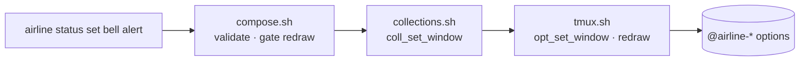
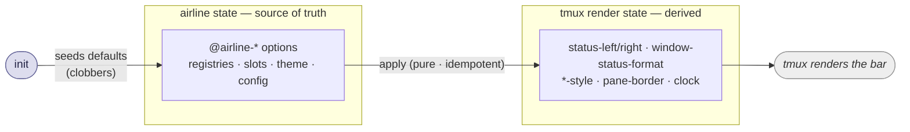

# tmux-airline — Design

Status of this document:

- **Settled** — module architecture, layering, dependency direction, the
  build-time enforcement strategy, and the CLI/API surface. Don't relitigate
  without a reason.

## Principles

1. **Semantic public surface, mechanical internal surface.** The CLI speaks in
   domain terms (`status`, `health`, `segment`, `theme`, `bundle`); it funnels down through
   composition logic to a single mechanical layer that talks to tmux. Callers
   never set `@airline-*` options by hand.
2. **One path to set state.** Internal startup, user commands, and plugin calls
   all take the same route — the CLI, and `init`/`apply` beneath it. There is no second,
   divergent way to build or repaint the bar. (This is the rule the old
   `main()` / `_airline_rebuild` split violated, which is why a theme change
   only half-repainted.)
3. **The middle is logic.** Composition — the badge stack, the health reduce,
   segment-slot assembly, render expressions, theme application — is expressed
   in domain terms and never calls tmux directly.
4. **No runtime enforcement.** Bash gives us one global namespace and no
   visibility modifiers, so layers are a convention. We enforce it at **build
   time** with a lint, not at runtime.
5. **Validate at the boundary; trust the interior.** Input is checked once, at
   the CLI boundary (against `compose.sh`'s predicates). Everything below — the
   store, the composition — trusts what it is handed, so no function carries both
   "is this valid?" and "do the work." This mirrors the original's split between
   `airline_segment_register` (validates) and `_segment_define` (trusting store);
   trusted internal callers use the store directly and skip validation.

## Invariants carried from the original

The rework improves layering, but the original had qualities worth *not*
regressing. Treat these as a checklist as code migrates:

1. **Boundary validation, trusting interior** (Principle 5) — don't push input
   checks into shared interior functions.
2. **Redraw-gating** — only refresh the client when the *rendered* value actually
   changes (old `airline_status_set`). `apply` must use `opt_setif_*` ("exit 0 =
   changed") to gate the redraw, or we regress flicker/responsiveness.
3. **Idempotent, sentinel-gated defaults** — a reload must not clobber runtime
   customization (old `register_default_segments` sentinel). `init`/`apply` keep this.

## Modules & roles

| File | Role | Calls `tmux`? | Depends on |
|------|------|:---:|------------|
| `airline.tmux` | **Entry point.** Run by TPM / `run-shell`. Invokes `init`/`apply` through the CLI; holds no logic. | no (only invokes the CLI) | `airline` |
| `airline` | **CLI / API — the boundary.** Public surface for users, `airline.tmux`, and external plugins. Parses and **validates** input (the only place it is checked), then stores via `opt_*` or dispatches to `compose.sh`. Holds the command handlers and the `use` data-file readers. | no | `compose.sh`, `tmux.sh` |
| `compose.sh` | **Composition.** Loads the palette and builds the bar (`status-left/right`, window formats, `apply`) from the stored `@airline-*` state. Owns the shared vocabulary — slot/element names + the predicates the CLI validates against — and *trusts* its inputs. Reads/writes only through `collections.sh` / `tmux.sh`. | **no** | `collections.sh`, `tmux.sh`, `widgets/*.sh` |
| `collections.sh` | **Collections (status & health only).** A registry (explicit key list) + per-key tuples over options, split with bash `IFS` — the "0 or more" shape behind lit lanes and health contributors. Pure bash on `opt_*`; no direct tmux calls, no domain terms. Segments are *not* collections. | no (via `tmux.sh`) | `tmux.sh` |
| `tmux.sh` | **Mechanical.** The *sole* caller of the `tmux` binary: scoped option get/set/unset, redraw, `source-file`, hooks, binds. No airline-invented abstractions. | **yes (only here)** | — |
| `widgets/*.sh` | **External widget adapters.** Configure third-party tmux plugins for airline — translate `THEME` into their `@plugin-*` options (cpu, battery, online, prefix-highlight). Logic tier. | no (via `tmux.sh`) | `tmux.sh` |
| `scripts/*.sh` | **Generic helpers.** Cross-cutting shell utilities with no render role (e.g. plugin-install checks). Reserved for generic concerns — *not* widgets. | no | — |
| `themes/*` | **Built-in themes.** Delimited data (`<element> <color>`), read by `theme use` and replayed as `theme set` calls. Not sourced, not executed. | n/a (data) | — |
| `bundles/*` | **Built-in status-bar bundles.** Delimited data (`<slot> <format>`), read by `bundle use` and replayed as `segment set` calls. | n/a (data) | — |

Notes:

- **Collections are their own layer, not part of `tmux.sh`.** tmux defines
  options, hooks, binds, and redraw — *not* dynamic keyed collections, which are an
  airline abstraction. So `collections.sh` sits *above* `tmux.sh`, built on its
  `opt_*` functions. Because it makes no direct tmux calls it stays *off* the lint
  allowlist, leaving `tmux.sh` the genuinely sole tmux caller.
- **Only status and health are collections.** They hold 0-or-more dynamic entries.
  Segments are a *fixed* set of named slots — plain keyed `opt_*`, no collection,
  no registry. Themes are files. Don't grow the collection abstraction back over
  things that aren't variable-cardinality.
- **`tmux.sh` is named for where tmux calls live, not for "options only."** It
  also owns redraw, hooks, binds, and mode toggles. Don't let the short name
  tempt the suspend/hook code back into the logic layer.
- **`widgets/` vs `scripts/`.** `widgets/` holds the external on-bar widgets
  configured for airline (the cpu/battery/online/prefix adapters); `scripts/` is
  reserved for generic shell concerns. Keep the two from blurring — a new bar
  widget goes in `widgets/`, a generic utility in `scripts/`.

## Dependency graph

Every edge points *down* toward `tmux.sh`; nothing points back up. The graph is
acyclic — that linearity is the property the file split exists to guarantee.


A representative write path — the semantic→mechanical funnel for one command:



## Data flow: `init` and `apply`

airline's `@airline-*` options are the **source of truth** (input): the status /
health registries, the segment slots, the theme colors, and config. tmux stores
them but takes no behavior from them. The tmux-native options that actually render the bar
(`status-left`, `window-status-format`, the `*-style` options, pane borders,
clock) are **derived output**. Two verbs sit on the two sides of that arrow:



- **`apply`** is the pure function `airline-state → tmux-output`. It is the
  composition mechanism — today's `_airline_rebuild` *plus* the style / pane /
  clock sets it currently omits. It also **configures the installed widgets** from
  the current `THEME` (the role→`@cpu_*`/`@batt_*`/… mapping) — that mapping is
  logic, identical across themes, so it can't live in theme data files. That
  omission is the half-repaint bug; `apply` doing the *full* compose is the fix.
- **`init`** is the only verb that writes airline's input state: it seeds the
  default segment slots, installs the F12 binds, publishes `@airline-cli`, and
  seeds config — clobbering to a known baseline — then ends by calling `apply`.

|  | writes airline state (input) | composes tmux output |
|---|:---:|:---:|
| `init` | ✓ (clobbers to defaults) | ✓ (via `apply`) |
| `apply` | — | ✓ |

What calls what:

- `airline.tmux` (entry point) → `init` on first run; `apply` on a bare config
  reload, so re-sourcing `.tmux.conf` doesn't clobber runtime state back to the
  defaults (a sentinel guards the clobber).
- every mutation (`theme use`, `status set`, `segment set`, …) → `apply`.
- a user who hand-edited an `@airline-*` override → `airline apply` to re-render.

This replaces the divergent `main()` / `_airline_rebuild` pair: one compose path,
so a theme switch repaints the whole bar.

## Enforcement (build-time lint)

No runtime guards. A lint (gated in CI next to shellcheck, surfaced as
`test/architecture.bats` with didactic failure messages) checks two invariants:

- **A — only `tmux.sh` invokes the `tmux` binary.** Allowlist: `tmux.sh`.
  `collections.sh` is *not* on it — it reaches tmux only through `opt_*`, so there
  are no direct calls to flag. (`themes/` and `bundles/` are pure data — no tmux
  calls to begin with.) Excluded: the `AIRLINE_TMUX` test shim's `tmux ()` wrapper.
- **B — the private `@airline-*` schema has one source of truth.** Callers pass
  option *names* to `opt_*`, so names legitimately appear at call sites (Invariant
  A still guarantees they reach tmux only through the option layer). What B forbids
  is *duplicating the layout*: the collection key scheme (`@airline-<ns>` list +
  `@airline-<ns>-<key>` tuples) is built only in `collections.sh`, and fixed scalar
  names live as named constants referenced elsewhere. (Data files use *semantic*
  names — `active`, `right-mid` — not `@airline-*`, so they don't participate.)

These are grep-able. The plan is to land the lint first and let it run **red** —
its violation list (today: everything in the current `airline.tmux`, the existing
record store, and the ~46 `tmux set` calls in the widget adapters) becomes the
rework worklist.

## The CLI/API surface

The public, stable contract. Users, `airline.tmux`, and external plugins drive
airline through these verbs; nobody sets `@airline-*` options by hand. Argument
detail (flags like `--transient`, `-t <window>`, `--side`, `--format`) lives in
`airline --help`; this section fixes the *grammar*, not the man page. (The
`-t <window>` flag, where it appears, scopes *which window* a command targets —
a separate axis from the positional `<target>` a `set` writes to.)

### Top-level verbs (whole-system, no noun)

```
airline init                 # seed airline state from defaults, then apply
airline apply                # compose tmux output from current airline state
airline suspend | resume     # set the suspended flag + apply; also toggles prefix/key-table
airline help                 # usage  (also -h / --help, and <noun> help)
```

### Nouns and their verbs

```
airline status   register | unregister | set | clear | show
airline health                          set | clear | show
airline segment                         set | clear | show
airline theme    set | use | show
airline bundle   use
```

### Verb conventions

The verbs are not chosen per noun — they fall into three fixed roles, and which
roles a noun gets is determined by its data model:

| Verb | Role | status | health | segment | theme | bundle |
|------|------|:--:|:--:|:--:|:--:|:--:|
| `register` / `unregister` | declare an entry that carries config (glyph + priority) | ✓ | — | — | — | — |
| `set` / `clear` | write / remove a **value** at a **target** | ✓ | ✓ | ✓ | set¹ | — |
| `use <name>` | replay a delimited **data file** as `set` calls — no execution | — | — | — | ✓ | ✓ |
| `show` | read current state | ✓ | ✓ | ✓ | ✓ | — |

¹ `theme set <element> <color>`; no `clear` — a `use` replaces the whole palette.

- **`register`/`unregister`** when an entry carries presentation config that must
  be declared before use — a status *lane* (glyph + priority). The registry is
  airline-owned.
- **`set <target> <value>` / `clear <target>`** write or remove a *value* at a
  target — a lane's lit token, a health key's severity, a segment slot's format, a
  theme color element. `set` **always** takes a (target, value) pair; no
  exceptions. (The `-t <window>` flag is a separate axis: it scopes *which
  window*, not what is being set.)
- **`use <name>`** replays a delimited data file as a batch of `set` calls — a
  theme file is `<element> <color>` lines (→ `theme set`), a bundle file is
  `<slot> <format>` lines (→ `segment set`). It only ever reads data and calls
  `set` — no sourcing, no execution — so `<name>` may be a packaged file or an
  absolute path with equal safety. See *Data files* below.
- **`show`** always — the component's current state (for `theme`, the current
  palette). One read verb across all nouns; we deliberately do not mirror tmux's
  own `show`/`list` split, for internal consistency.

The asymmetries are the data model showing through, not inconsistencies:

- **health has no `register`** — keys are dynamic contributors (one per
  job/agent) with no config; created on first `set`, gone on `clear`.
- **segment has no `register`** — its targets are a *fixed* set of named slots
  (`left-out`, `left-mid`, `left-in`, `right-in`, `right-mid`, `right-out`), so
  there is nothing to declare; you `set`/`clear` a slot's format. Not a
  collection — just keyed options at known names.
- **theme has no `clear`; bundle has only `use`** — `theme set <element> <color>`
  writes one color and a `theme use` replaces the whole palette, so there's nothing
  to `clear`. A bundle is *only* a data file you `use` (its individual writes are
  `segment set`s), so it carries no setter of its own.

### Private verbs

Internal but CLI-reachable callbacks use a leading underscore:

```
airline _unfocus <window-id>     # pane-focus-out hook callback (clears --transient signals)
```

`init` and `apply` are public (no underscore): the entry point, mutations, and
users all call them.

### Data files (`themes/`, `bundles/`) and `use`

Themes and bundles are **delimited data files** — not scripts, not tmux
source-files:

```
themes/<name>     <element> <color>     e.g.  active    colour214
bundles/<name>    <slot> <format>       e.g.  right-mid #{cpu_fg_color}#{cpu_icon}…
```

`theme use <name>` reads the theme file and runs `theme set <element> <color>` per
line; `bundle use <name>` reads the bundle file and runs `segment set <slot>
<format>` per line. That is the whole mechanism. Consequences:

- **No execution.** A data file can only ever yield validated `set` calls, so a
  `<name>` is safe whether packaged or an absolute path — `use` reads data, it
  never sources or runs code.
- **Semantic, not tmux, names.** Files name *elements* and *slots* (`active`,
  `right-mid`), never `@airline-*`; airline owns that mapping. Invariant B holds
  for free, and the files contain no tmux calls — nothing to lint.
- **`set` is store-only.** A `use` is N `set`s then one `apply`; if `set` rendered,
  a 14-line theme would repaint 14 times. Config `set`s (theme, segment) only write
  options; `apply` renders. (status/health `set` are the exception — runtime events
  that redraw immediately, not part of a batch.)
- **Widget colors aren't in the data.** A bundle's cpu slot is static text like
  `#{cpu_fg_color}#{cpu_icon}#[fg=#{@airline-emphasized},bg=#{@airline-middle-bg}]`,
  referencing `@cpu_*` (set by `apply`'s widget config) and `@airline-<role>` (set
  by `theme set`) **live** — so the format is theme-agnostic data. The role→widget
  mapping is logic; it lives in `apply`, not duplicated across theme files.

The `airline`-runs-a-file-that-calls-`airline` cycle is benign: the inner calls are
store-only `set`s (no re-entry), and `use` does the single `apply` at the end.

## The mechanical layer (`tmux.sh`)

The sole caller of the `tmux` binary. Conventions:

- **No flags, ever.** Fixed positional args; scope and behavior are encoded in the
  *name* (`opt_set_window`, not `opt_set -w`). This is what makes the lint a grep.
- **Returns:** getters echo to stdout (empty when unset); predicates use exit
  status; mutators are silent.
- **Composition:** a few private cores (`_opt_*`) do the actual call; every public
  function is a thin wrapper that bakes in scope/behavior.
- **Modern Bash (4.3+):** `[[ ]]`, `printf %s` over `echo`, arrays, namerefs where
  they save a subshell.
- A function exists **only for a tmux subcommand that isn't an option.** Built-in
  options (`prefix`, `key-table`, `focus-events`, `status-left`, …) go through
  `opt_set_global` / `opt_unset_global`, not bespoke functions.

### Scalar options (`opt_*`)

Private cores — the last positional is the option name, everything before it is
scope:

```bash
_opt_show  () { tmux show-options -qv "$@"; }   # _opt_show  <scope…> <name>
_opt_write () { tmux set-option   -q  "$@"; }   # _opt_write <scope…> <name> <value>
_opt_clear () { tmux set-option   -qu "$@"; }   # _opt_clear <scope…> <name>
```

Public matrix — five verbs × two scopes (`global`, `window`):

| Verb | global | window | Purpose |
|------|--------|--------|---------|
| get   | `opt_get_global <name>` | `opt_get_window <win> <name>` | echo value, empty if unset |
| getor | `opt_getor_global <name> <def>` | `opt_getor_window <win> <name> <def>` | echo value, or default if unset |
| set   | `opt_set_global <name> <val>` | `opt_set_window <win> <name> <val>` | write (always) |
| setif | `opt_setif_global <name> <val>` | `opt_setif_window <win> <name> <val>` | set-if-needed — write only when changed; **exit 0 = changed** |
| unset | `opt_unset_global <name>` | `opt_unset_window <win> <name>` | remove |

Window functions always take an explicit window id; "current" is resolved by the
caller via `current_window`.

### Standalone verbs (distinct subcommands)

| Function | tmux call | Purpose |
|----------|-----------|---------|
| `redraw` | `refresh-client -S` | force a bar re-eval (no client → harmless) |
| `source_file <path>` | `source-file` | source a tmux config file (themes are data now, not sourced — candidate for removal if unused) |
| `current_window` | `display-message -p '#{window_id}'` | resolve "current" for window-scoped callers |
| `hook_set <spec> <cmd>` / `hook_unset <spec>` | `set-hook -g` / `-gu` | the focus-out consume-on-view hook |
| `key_bind <table> <key> <cmd>` / `key_unbind <table> <key>` | `bind-key` / `unbind-key` | the F12 suspend/resume binds |

## Collections (`collections.sh`) — status and health only

status and health each hold *0 or more* dynamic entries — lanes lit on a window,
health contributors reporting in — which tmux's flat option store has no concept
of. `collections.sh` adds exactly that, and **only** for these two; segments are
not a collection (they're fixed slots — see the CLI section). No tmux calls (built
on `opt_*`), no domain knowledge: `status` / `health` arrive as the `ns` argument.

Two storage shapes, each a single-delimiter string split with bash `IFS`/`read` —
no awk, no jq, no subprocess on the hot path:

```
@airline-<ns>          registry: a space-delimited list of keys (membership)
@airline-<ns>-<key>    that entry's fixed-arity tuple, tab-delimited
```

Rules:

- **Names are data, never inferred.** Membership is the registry list; we never
  discover entries by globbing/parsing `@airline-*` option names. Keys are only
  ever *constructed* from `(ns, key)`, so a key may contain `-`.
- **One delimiter per option.** Registry = space-delimited names; tuple =
  tab-delimited fields (the lone arbitrary field, a status glyph, is never a tab).
  Fixed arity: `set` writes the whole tuple, so field positions stay stable.
- **Storage ≠ render.** A collection holds airline's bookkeeping; `apply` reads it
  and projects the options tmux renders (the per-lane render references, the
  reduced health scalar). The store is never itself the live render reference —
  that coupling in the old model is why changing storage *looked* like it broke
  rendering.

`coll_*` mirror `opt_*`'s scope suffix (`_global` / `_window <win>`). Ops:
`register` / `unregister` (key-list membership), `members` (the list),
`get` / `set` (the per-key tuple), and `reduce` (health's max severity). Pure
bash, zero-dependency.

This refines the existing `record.sh`: keep the registry list, pack each entry's
attributes into one tab-delimited tuple instead of an option-per-attribute, and
drop segments out of it entirely.
