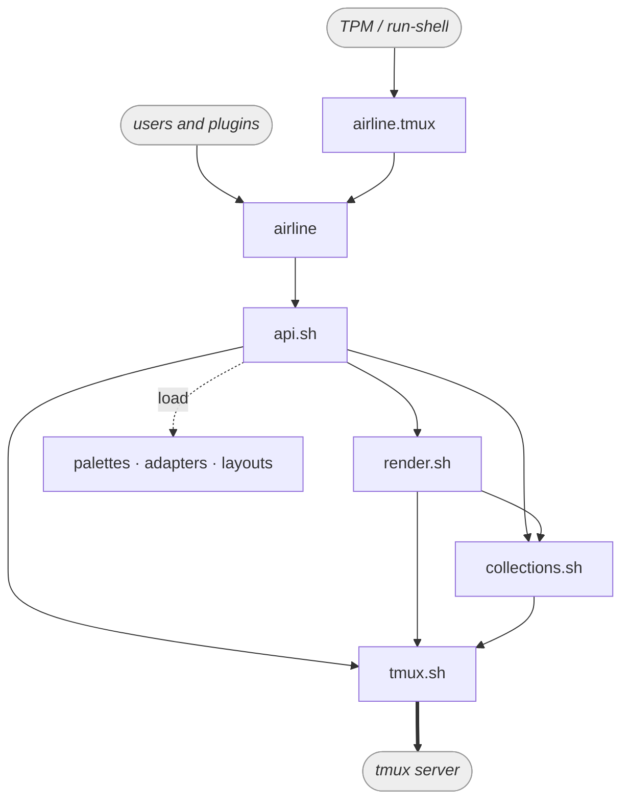
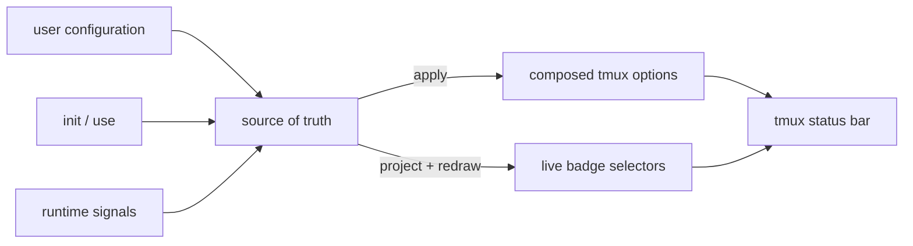

# tmux-airline — Design

This document defines the settled architecture, state model, and public command
grammar. Implementation details belong in the source and tests unless they protect
a non-obvious boundary described here.

## Principles

1. **State is split by ownership.** Public `@airline-*` options are the user-facing
   configuration contract. Private `@airline--*` options are runtime state written
   only by airline. Native tmux options are derived output.
2. **There is one composition path.** `render`, invoked by `apply`, is the only code
   that composes the bar. Runtime signals may update live selectors and redraw, but
   they never construct an alternative bar.
3. **The middle is logic.** Badge reduction, segment assembly, render expressions,
   and palette application use domain terms and do not call the `tmux` binary.
4. **Dependencies point down.** The CLI delegates to the API; the API orchestrates
   logic and collections; every tmux call ends in `tmux.sh`. The graph is acyclic.
5. **Validate at the boundary; trust the interior.** Public API handlers validate
   input once. Store and composition functions operate on validated values.
6. **Enforce architecture at build time.** Bash has no useful visibility boundary,
   so lightweight lint rules enforce layering without adding runtime machinery.
7. **Lifecycle operations are idempotent and redraw-gated.** Re-running `init` must
   not clobber established session choices, and rendering unchanged output must not
   refresh the client.

## Architecture

| File | Responsibility | Direct `tmux` calls? |
|------|----------------|:-------------------:|
| `airline.tmux` | TPM / `run-shell` entry point; invokes `init` through the CLI | no |
| `bin/airline` | Installable PATH shim; resolves the active CLI through `@airline-cli` | bootstrap lookup only |
| `airline` | Parses the public grammar and delegates each command once to `api_*` | no |
| `api.sh` | Resolves context, validates input, and orchestrates commands | no |
| `render.sh` | Owns domain vocabulary and composes the bar | no |
| `collections.sh` | Stores and reduces variable-cardinality state | no |
| `tmux.sh` | Mechanical operations and airline namespace policy | **yes; sole caller** |
| `palettes/*` | Declarative public color configuration | sourced by `tmux.sh` |
| `adapters/*` | Applies palette roles to third-party plugin options | no |
| `layouts/*` | Composes adapters and segment-slot values | no |
| `helpers/*` | Bash helpers for layout scripts; not public airline API | no |



The important boundaries are:

- Within the application layers, only `tmux.sh` invokes the `tmux` binary or spells
  the `@airline-` and `@airline--` prefixes. The installable PATH shim is an external
  consumer: like a plugin, it makes one bootstrap lookup of `@airline-cli`. Higher
  layers address airline options by bare key through `pub_*` and `prv_*` accessors.
- `collections.sh` is an airline abstraction above tmux's flat option store. It is
  used only for status, health, problem, adapter membership, and search paths.
  Fixed segment slots are scalar options, not collections.
- Palette and layout are independent axes: a palette chooses colors; a layout
  chooses adapters and segment strings. A palette change re-runs the stored layout
  so its adapters resolve against the new colors.

## State model

State falls into four kinds:

| Kind | Written by | Examples |
|------|------------|----------|
| **Public options** `@airline-*` | user defaults and airline session overrides | palette roles, segment slots, `@airline-cli` |
| **Private options** `@airline--*` | airline at runtime | contributors, projected badges, suspension, active selections, paths |
| **Composed output** | `render` | `status-left/right`, window formats, styles, pane borders, clock color |
| **Constants** | source code only | glyphs, chevrons, name template, vocabularies, precedence tables |

The classification is mechanical:

- A value is an option when something outside `render` writes it. A fixed value
  used only while rendering is a Bash constant.
- Public versus private is a contract boundary. Users may set `@airline-*` and may
  read `@airline-cli`; all other airline-managed state is read through the CLI.
- Native tmux output is derived. Users configure the public inputs, not
  `status-left`, `window-status-format`, or the other rendered snapshots.

### Scope and inheritance

A user's `set -g @airline-*` supplies a global default. Palettes and layouts install
session-local overrides. Rendering reads the effective session value: the override
when present, otherwise the global default.

Private state exists at its native owner:

- status and health contributors and their projected badges are window-scoped;
- problems, selections, guards, paths, suspension, and adapter membership are
  session-scoped;
- there is no private-global state.

### Apply and live updates

Public inputs and private state are the source of truth. `apply` re-runs the active
layout, allowing adapters and slots to resolve against the active palette, and then
calls `render` over the complete state.



The two update modes are deliberately different:

- Configuration changes move values that must be baked into the output. A direct
  `set -g @airline-*` stages a change; `apply` renders it. `palette use` and
  `layout use` end in an apply automatically.
- Runtime `status`, `health`, and `problem` changes update their collections,
  project a scalar badge value, and redraw. The already-composed selector follows
  the scalar, so no apply is needed.

`init` publishes `@airline-cli`, installs missing default palette and layout
selections behind a session sentinel, and renders. Re-running it does not overwrite
an existing session selection. A global `after-new-session` hook initializes future
sessions using an explicit session target.

### Render boundary

The status bar contains three kinds of value:

1. **Baked constants.** Palette colors, chrome, chevrons, styles, and adapter colors
   change only on `apply`.
2. **Live selectors.** Tmux `#{?…}` expressions select among baked colors for status,
   health, problem, zoom, copy mode, and activity. The choice is reevaluated by tmux;
   the branch colors were baked by airline.
3. **Live readings.** Plugin values such as CPU usage and tmux values such as the
   clock remain `#{…}` references and update on the normal status interval.

The rule is: **colors are baked; selectors and readings are live.** `apply` renders
only what must be baked.

## Configuration kinds

There are three loadable kinds and one plain-option kind:

| Kind | Representation | Lifecycle |
|------|----------------|-----------|
| **palette** | targetless tmux config containing public color options | `use` sources it into a session, records it, then applies |
| **adapter** | Bash snippet mapping `PALETTE` roles to plugin options | `use` or `load` executes it and records active membership |
| **layout** | shell composition invoking adapters and setting segment slots | `use` or `load` clears slots, executes it, records it, then renders |
| **segment** | public `@airline-segment-<slot>` option | set directly or by a layout; not loadable |

For palette, adapter, and layout:

- `register <dir>` prepends a trusted search location;
- `available` lists resolvable bare names, deduplicated in search order;
- `use <name>` accepts a bare name and resolves it only within registered paths.

`load <path>` is the explicit one-off operation for executable adapter and layout
files. `layout load` stores the absolute path because `apply` must re-run it from any
working directory. Adapter loading is one-shot for reapplication purposes: the
layout is the durable lifecycle unit and must invoke its adapters again.

Palette and segment configuration need no `load` verb. They are ordinary tmux
configuration, so `source-file` followed by `apply` is the native one-off workflow.

Adapters and layouts are ordinary trusted shell, not a mini-language. Registration
and explicit loading are the trust boundaries. Nested airline calls defer rendering
so a complete layout produces at most one redraw.

A segment may reference a palette foreground role live, but must not set a
background. Render owns each block background and its matching chevrons; allowing a
slot to replace the background would break that seam.

## CLI and API contract

`airline` is a parser and dispatcher. Each successful command arm makes exactly one
public `api_*` call; context resolution, sequencing, state access, and rendering stay
behind that boundary.

### Grammar

```text
airline init
airline apply
airline show
airline help

airline status   set <key> <level> [--transient] [-t <window>]
                 clear <key> [-t <window>]
                 show [<key>] [-t <window>]
airline health   set <key> <ok|warn|fail> [--transient] [-t <window>]
                 clear <key> [-t <window>]
                 show [<key>] [-t <window>]
airline problem  set <key> <ok|warn|fail> [<message>] [-t <session>]
                 clear <key> [-t <session>]
                 show [<key>] [-t <session>]

airline palette  show [name|<element>] | available | use <name> | register <dir>
airline segment  show [<slot>]
airline adapter  show | available | use <name> | load <path> | register <dir>
airline layout   show [name|path] | available | use <name> | load <path> | register <dir>
airline state    suspend | resume | toggle | show

airline _unfocus <window-id>
```

`_unfocus` is an internal, CLI-reachable hook callback. All other listed commands
are public.

### Conventions

- `apply` is whole-system because there is one render over the complete source of
  truth. There are no per-noun apply commands.
- `set` and `clear` belong to dynamic signal nouns. Static palette elements and
  segment slots are written with `set -g @airline-*` and removed with `set -gu`.
- Bare `<noun> show` produces a labeled human summary. Qualified `show <field>`
  prints one raw, newline-terminated value suitable for scripts.
- `palette show name` and `layout show name` expose their active selection. Layout
  also exposes its resolved path.
- `adapter show` lists the active adapter set, one name per line. `available` is a
  separate catalog of what could be selected.
- `-t` accepts a window target for status and health and a session target for
  problem. A pane target is valid where tmux can resolve its owning window.
- `state` is the active/suspended axis. Suspension derives a muted palette and traps
  the prefix; airline itself installs no key binding.

Static options deliberately retain normal tmux behavior: changing a value at
runtime requires `set -g …` followed by `apply`, and an unknown option name is not
validated. This keeps configuration readable and composable with tmux instead of
adding a parallel configuration API.

## Collections and badge projection

Status and health hold zero or more contributors per window. Problem holds zero or
more failures per session. Each collection uses an explicit registry and a tuple per
member:

```text
@airline--<namespace>       space-delimited member registry
@airline--<namespace>-<key> tab-delimited fixed-arity tuple
```

Collection rules:

- Membership is explicit; entries are never discovered by parsing option names.
- `set` writes the entire tuple and registers the key. `unregister` also removes the
  tuple.
- Keys may contain `-`. Registry keys cannot contain spaces; problem messages may
  contain spaces but not tabs.
- Storage is never rendered directly. A domain-specific caller reduces the
  collection and projects the result to `badge-status`, `badge-health`, or
  `badge-problem`.
- Reduction receives its ranking as data, keeping `collections.sh` free of status,
  health, and problem semantics.

Health and problem share the condition ladder `ok < warn < fail`. `ok` or absence is
normal and invisible; `warn` maps to `alert`; `fail` maps to `stress`. Health is
window-scoped and may be transient. Problem is session-scoped and retains a message.

Status uses `active < result < attention`: ongoing work, a result to inspect, and a
request for input. These map to `active`, `ok`, and `alert`. Status and health are
distinguished by position around the window name, so sharing palette roles is safe.

## Mechanical boundary

`tmux.sh` is the sole integration point with tmux. Its interface follows these
conventions:

- Functions use fixed positional arguments. Scope is expressed in the name, such as
  `opt_set_window`, rather than selected with flags.
- Getters write to stdout, predicates use exit status, and mutators are silent.
- Session- and window-scoped functions take explicit targets. Callers resolve an
  omitted target once and pass the resulting id downward.
- `opt_*` handles native option mechanics; `pub_*` and `prv_*` add airline namespace
  policy; standalone wrappers cover redraw, source-file, target resolution, hooks,
  and binds.
- `setif` returns success when it changed a value. Orchestration accumulates those
  results and redraws once only when rendered output changed.

Public accessors support global defaults and effective session reads. Private
accessors support only session and window ownership, plus `prv_name` for embedding a
private scalar in a tmux format. There is no private-global accessor.

## Enforcement and testing

`test/architecture.bats` enforces three build-time rules:

- **A — tmux ownership:** only `tmux.sh` invokes the `tmux` binary inside the
  application. The external PATH shim, test shims, and inert tmux configuration are
  explicit exclusions.
- **B — namespace ownership:** only `tmux.sh` constructs literal `@airline-` and
  `@airline--` names in shell code. Palette and segment configuration spell public
  names because those names are the external contract.
- **C — CLI delegation:** public parser arms call one public `api_*` entry. Only
  parser-owned help functions and designated private callbacks bypass that pattern.

The same boundary makes most tests cheap:

| Suite | Backend | Responsibility |
|-------|---------|----------------|
| `tmux.bats` | real tmux | pins the mechanical contract that the fake must match |
| `collections.bats` | in-memory fake | collection storage and reduction |
| `logic.bats` | in-memory fake | composition and exact format strings |
| `cli.bats` | real tmux subprocess | parser, dispatch, and integration behavior |
| `architecture.bats` | static inspection | layering invariants |

`test/fake-tmux.sh` sources the real mechanical wrappers and replaces only their
leaf store operations and standalone tmux verbs. It models option scope, absence,
overwrite, removal, and preservation of spaces; it does not evaluate tmux formats.

## Lessons from failed approaches

These are retained because they explain constraints that are otherwise tempting to
remove.

### Two composition paths diverged

The former `main()` and `_airline_rebuild` paths each assembled part of the bar. A
palette change exercised only one path, so it repainted the bar incompletely. The
replacement is one `render` function over the whole source of truth, reached through
`apply`. Runtime signals may redraw live selectors but never compose output.

### Rendering collection storage coupled display to tuple shape

Referencing a contributor tuple directly from a tmux format made the display depend
on the storage tuple's arity. Adding metadata such as the transient marker could
therefore change the value seen by the renderer. Collections now reduce into a
separate scalar badge option, and render references only that stable projection.

### Bats `run` hid mutations made against the fake

The in-memory fake lives in the test process, while Bats `run` executes its command
in a subshell. A mutation inside `run` disappears before the following assertion,
although the equivalent operation against a real tmux server persists externally.
Tests that mutate and then inspect fake state must call the function directly and
capture its status with `|| rc=$?`.
