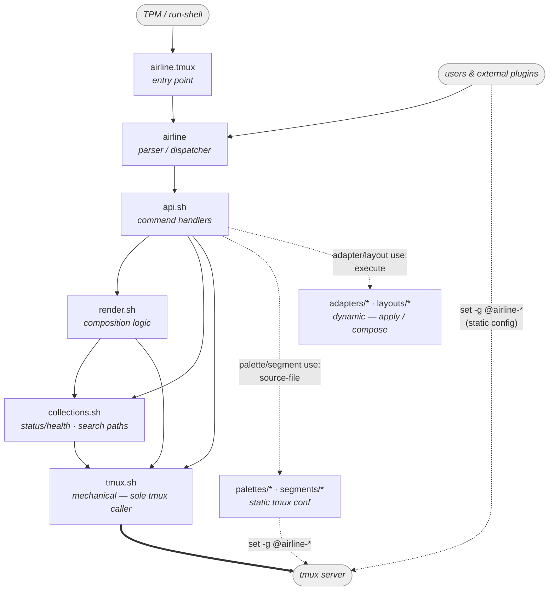
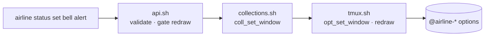
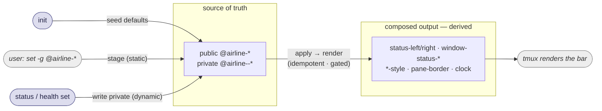

# tmux-airline — Design

Status of this document:

- **Settled** — module architecture, layering, dependency direction, the
  build-time enforcement strategy, and the CLI/API surface. Don't relitigate
  without a reason.

## Principles

1. **Two classes of state, split by who writes them** (see *State model* below).
   *Static* config is **public** `@airline-*` options a user sets directly, the
   idiomatic tmux way. *Dynamic* state is **private** `@airline--*` options only
   airline writes, at runtime, through the CLI. The CLI speaks domain terms
   (`status`, `health`) for the dynamic part and owns the lifecycle
   (`init`, `apply`, `use`); it does not wrap the static part — `set -g @airline-*`
   is the API for that.
2. **One render path.** Whatever moves the source of truth — a user editing an
   option, a runtime event, `init` — the bar is (re)built by a single path:
   `render`, invoked by `apply`. There is no second, divergent way to build or
   repaint the bar. (This is the rule the old `main()` / `_airline_rebuild` split
   violated, which is why a palette change only half-repainted.)
3. **The middle is logic.** Composition — the badge reduce (status and health
   both collapse many contributors to one mark), segment-slot assembly, render
   expressions, palette application — is expressed in domain terms and never calls
   tmux directly.
4. **No runtime enforcement.** Bash gives us one global namespace and no
   visibility modifiers, so layers are a convention. We enforce it at **build
   time** with a lint, not at runtime.
5. **Validate at the boundary; trust the interior.** Input is checked once, at
   the CLI boundary (against `render.sh`'s predicates). Everything below — the
   store, the composition — trusts what it is handed, so no function carries both
   "is this valid?" and "do the work." This mirrors the original's split between
   `airline_segment_register` (validates) and `_segment_define` (trusting store);
   trusted internal callers use the store directly and skip validation.

## Invariants carried from the original

The rework improves layering, but the original had qualities worth *not*
regressing. Treat these as a checklist as code migrates:

1. **Boundary validation, trusting interior** (Principle 5) — don't push input
   checks into shared interior functions.
2. **Redraw-gating** — only refresh the client when the *rendered* value actually
   changes (old `airline_status_set`). `apply` must use `opt_setif_*` ("exit 0 =
   changed") to gate the redraw, or we regress flicker/responsiveness.
3. **Idempotent, sentinel-gated defaults** — a reload must not clobber runtime
   customization (old `register_default_segments` sentinel). `init`/`apply` keep this.

## Modules & roles

| File | Role | Calls `tmux`? | Depends on |
|------|------|:---:|------------|
| `airline.tmux` | **Entry point.** Run by TPM / `run-shell`. Invokes `init` through the CLI (which renders the bar; the sentinel skips the clobber on a bare reload); holds no logic. | no (only invokes the CLI) | `airline` |
| `airline` | **CLI — parser & dispatcher.** The entry users / `airline.tmux` / plugins call. Holds no logic: points the mechanical layer at the tmux server, sources the stack, and routes argv to an `api.sh` handler. | no | `api.sh` (+ the layers) |
| `api.sh` | **Command handlers — the API logic.** One handler per verb; owns input **validation** (the only place input is checked, against `render.sh`'s predicates), then drives the layers — `opt_*` / `coll_*` to mutate, `render` to produce the bar. | no | `render.sh`, `collections.sh`, `tmux.sh` |
| `render.sh` | **Composition.** Loads the palette into `PALETTE` and implements `render` (what `apply` runs) — producing the bar (`status-left/right`, window formats, `*-style`, pane, clock) from the public `@airline-*` inputs and private `@airline--*` state. Owns the shared vocabulary — slot/element names, the rendering constants (glyphs, chevrons, name template), and the predicates the CLI validates against. *Trusts* its inputs. | **no** | `collections.sh`, `tmux.sh` |
| `collections.sh` | **Collections (status & health only).** A registry (explicit key list) + per-key tuples over options, split with bash `IFS` — the "0 or more" shape behind the status and health contributors that each reduce to one badge. Pure bash on `opt_*`; no direct tmux calls, no domain terms. Segments are *not* collections. | no (via `tmux.sh`) | `tmux.sh` |
| `tmux.sh` | **Mechanical + namespace policy.** The *sole* caller of the `tmux` binary: scoped option get/set/unset, redraw, `source-file`, hooks, binds. Also the *sole* owner of the `@airline-` / `@airline--` prefixes — the `pub_*` / `prv_*` accessors and `prv_name` builder, so every layer above names airline options by bare key. | **yes (only here)** | — |
| `palettes/*` | **Built-in palettes** *(static config).* Plain tmux files of `set -g @airline-<element> <color>` lines, loaded by `palette use` (`source-file`). Config, not production shell — it sets *public* options the idiomatic way. | sets public options (sourced by `use`) | — |
| `segments/*` | **Built-in segment sets** *(static config).* Plain tmux files of `set -g @airline-segment-<slot> <format>` lines, loaded by `segment use`. Same shape as a palette; the split is only by convention (colors vs arrangement). | sets public options (sourced by `use`) | — |
| `adapters/*` | **Plugin adapters** *(dynamic).* A bash snippet per third-party plugin (cpu/battery/online/prefix-highlight): `opt_set_global @<plugin>-* "${PALETTE[role]}"`. `adapter use` sources it *after* loading `PALETTE`, so it sets **literal** colors, re-applied on every palette change. No function wrapper, no install guard — airline only sets the plugin's options; the plugin draws its own meter. Scanned by the lint (must use `opt_*`). | no (via `tmux.sh`) | `tmux.sh` |
| `layouts/*` | **Compositions** *(dynamic).* A short interpreted script — `adapter use …` / `segment use …` lines (composition verbs only). `layout use` runs it and records the active layout (`@airline--layout`); `apply` re-runs it. Never sets the palette — that's the orthogonal axis. | no (runs airline verbs) | `api.sh` handlers |

Notes:

- **Collections are their own layer, not part of `tmux.sh`.** tmux defines
  options, hooks, binds, and redraw — *not* dynamic keyed collections, which are an
  airline abstraction. So `collections.sh` sits *above* `tmux.sh`, built on its
  `opt_*` functions. Because it makes no direct tmux calls it stays *off* the lint
  allowlist, leaving `tmux.sh` the genuinely sole tmux caller.
- **Only status and health are collections.** They hold 0-or-more dynamic entries.
  Segments are a *fixed* set of named slots — plain keyed `opt_*`, no collection,
  no registry. Palettes are files. Don't grow the collection abstraction back over
  things that aren't variable-cardinality.
- **`tmux.sh` is named for where tmux calls live, not for "options only."** It
  also owns redraw, hooks, binds, and mode toggles. Don't let the short name
  tempt the suspend/hook code back into the logic layer.
- **Four config kinds, two static + two dynamic.** *Palette* (colors) and *segments*
  (arrangement) are static tmux-conf files, loaded by `source-file`. *Adapters*
  (palette→plugin) and *layouts* (compositions) are dynamic — executed, not sourced
  into tmux. `render` never touches adapters: an adapter is applied by `adapter use`
  (which a layout invokes), so the palette→plugin bridge lives in the layout re-apply
  path, not the render path.
- **Palette ⟂ layout.** A palette is the colors; a layout is the arrangement (which
  adapters + which segment set), and it *never* sets the palette. So you compose one
  of each — N palettes + M layouts, not N×M. A palette swap re-runs the stored layout
  so its adapters re-resolve to the new colors ("new palette → everything switches").

## Dependency graph

Every edge points *down* toward `tmux.sh`; nothing points back up. The graph is
acyclic — that linearity is the property the file split exists to guarantee.



A representative write path — the semantic→mechanical funnel for one command:



## State model & data flow

airline's state splits into **four** kinds, by who writes a value and when. This
split is the spine of the whole design:

| kind | who writes | examples |
|------|-----------|----------|
| **Public** `@airline-*` — the **contract** | user config (`set -g`) *and* airline's one published read | palette colors · `@airline-segment-<slot>` · `@airline-cli` (the bootstrap handle) |
| **Private** `@airline--*` — **internal** | **airline** (runtime) | `--status[-key]` · `--health[-key]` · `--badge-status` · `--badge-health` · `--suspended` · active selections (`--palette` · `--segment` · `--layout`) · search paths (`--path-<kind>`) |
| **Composed output** (native tmux opts) | **airline** | at `apply` | `status-left/right` · `window-status-*` · `*-style` · pane borders · `clock-mode-color` |
| **Constant** (bash) | **nobody** (source) | — | glyphs · chevrons · name template · palette-token list · status ladder · severity ranking · slot→tier table |

The classification is mechanical, not stylistic:

- **A value is a tmux option only if something *outside render* writes it** — a
  user (public `@airline-*`) or airline at runtime (private `@airline--*`). A fixed
  value that only render *reads* is a **bash constant**, not an option. (A private
  option airline would write at init only to read back at render is pure overhead;
  a constant baked straight into the format string does the identical thing.)
- **Public vs private is the *contract* boundary, not "who writes."** Public
  `@airline-*` is what the outside world touches: config a user sets (`set -g
  @airline-active colour214`) *and* the single value airline publishes for scripts to
  read — `@airline-cli`, the bootstrap handle (a script can't call the API to find the
  API). Everything else airline manages is **private**, **marked with a double dash**
  (`@airline--`), read only *through the CLI*, never as an option. The `--` keeps a
  user's `set -g @airline-…` out of internal state and lets a reader (or the lint)
  tell the class from the name. So airline's active palette is read via `palette
  current`, its state via `state show` — not by peeking at `@airline--*`.
- **The prefix is policy, owned by `tmux.sh`.** The `@airline-` / `@airline--`
  literals are written in exactly one file: `tmux.sh`, via the `pub_*` / `prv_*`
  accessors and the `prv_name` builder. Every layer above names options by **bare
  key** (`inner-bg`, `badge-status`) and never spells a prefix — so the public/
  private boundary is enforced at one chokepoint, not re-typed at each call site
  (Invariant **B**). Config files are the one exception: a user's `set -g
  @airline-active …` spells the public prefix because that *is* the public contract.
- **Composed output is derived, never authored.** The tmux-native options that
  render the bar are a *snapshot* of the inputs at render time; nobody edits them.

**Source of truth → derived output.** Public inputs and private state are the
source of truth; tmux stores them but takes no behavior from them. `apply` reads
the whole source of truth and renders it into the composed output:



- **Setting an input *is* the stage.** Whether a user runs `set -g @airline-active
  colour214` or airline writes a private `@airline--badge-status` at runtime, the
  bar keeps showing the previously-rendered output until the next render. There is no
  `stage` verb — moving an option is free; rendering is `apply`.
- **`apply` re-applies, then renders.** It re-runs the active layout (`@airline--layout`)
  so its adapters re-resolve `@<plugin>-*` to the current palette and its segment set
  is re-applied, then runs `render`: read the source of truth, bake palette colors in
  as literal constants, write the composed output. It composes from the *whole* source
  of truth — not per-noun — so any pending change is picked up. Idempotent and
  redraw-gated (`opt_setif_*`; one redraw iff something changed).
- **`use`** resolves a **bare name** on the kind's search path (`register` a dir to
  add locations — the sole trust boundary; there is no literal-path escape hatch) and
  records it active. *Static* kinds (`palette`, `segment`) `source-file` the resolved
  conf; *dynamic* kinds (`adapter`, `layout`) execute it. `palette use` ends in
  `apply` (a palette swap re-runs the layout → adapters re-color); `segment use` just
  renders.
- **`init`** applies a default of each axis behind a sentinel — `palette use default`
  if no palette is set, `layout use default` (which brings its segments) if none is —
  publishes `@airline-cli` (the public bootstrap handle), then renders. It binds no
  keys. The entry point calls `init` on first run *and* on a bare config reload; the
  sentinel skips the clobber on reload.

### What renders and what stays live

This is the constant-vs-dynamic split. The bar holds three kinds of value, and
`apply` only ever renders the first:

1. **Constants — colors.** Every palette color is baked as a literal `colourN` (or
   hex): `render` bakes the composed chrome (block bg/fg, chevrons, `*-style`
   options) at `apply`, and the active layout's **adapters** bake the plugins'
   `@cpu_*`/`@batt_*` options (from `PALETTE`) when the layout runs. A color changes
   only at the next `apply` — which re-runs both. This is the "render."
2. **Selectors — live, choose among baked colors.** A `#{?…}` expression tmux
   re-evaluates every render to pick *which baked color* shows: the status badge
   token, the health badge token (severity), and the window mode (zoom > copy >
   monitor). The mode lands where you're *not* looking — an inactive window in a
   mode fills its **background** with the mode color; the active window only tints
   its name **foreground**, keeping its constant active-color highlight block (same
   "signal where you're not looking" rule as the badges). The colors in the
   selector are baked at `apply`; *which branch fires* is live. `status`/`health`
   `set` drive their selectors by re-projecting the per-window scalar (the reduced
   badge winner) and forcing a redraw — no render; the mode selectors are driven
   by tmux's own `window_zoomed_flag` / `pane_in_mode` / `monitor-activity`.
3. **Plugin & clock readings — live, the point of a plugin.** `#{cpu_percentage}`,
   `#{cpu_fg_color}`, `%H:%M`, the online dot — tmux and the plugins re-evaluate
   these every status-interval. airline **never** renders for them; they live
   as `#{…}` refs inside the baked format string. (An adapter only bakes the plugin's
   *colors*; the plugin's own readings stay live.)

The law: **a color is baked; a selector is live; a reading is live.** `apply`
renders colors and nothing else — never the things that vary between applies. This
is why editing a color (`set -g @airline-*`) or a `use` needs an `apply` (they move
baked colors) but a job reporting status does not (it re-projects the scalar and
the selector follows, redraw only).

What calls what:

- `airline.tmux` (entry point) → `init` (first run clobbers; reload renders).
- a user setting a public option (`set -g @airline-*`) → stages only; the user
  runs `apply` when ready (so several edits batch into one render).
- `palette use <name>` → `source-file` the conf then `apply`; `layout use <name>` →
  run its composition then render (adapters re-applied against the current palette).
- a runtime event (`status set`, `health set`) → private contributor write +
  re-project the badge scalar + redraw, no `apply`.
- a `.tmux.conf` → sets public `@airline-*` directly, then `run-shell
  "#{@airline-cli} apply"` (or relies on the entry point's `init`).

This replaces the divergent `main()` / `_airline_rebuild` pair: one render path,
so a palette switch repaints the whole bar.

## Enforcement (build-time lint)

No runtime guards. A lint (gated in CI next to shellcheck, surfaced as
`test/architecture.bats` with didactic failure messages) checks two invariants:

- **A — only `tmux.sh` invokes the `tmux` binary.** Allowlist: `tmux.sh`.
  `collections.sh` is *not* on it — it reaches tmux only through `opt_*`, so there
  are no direct calls to flag. The lint **does** scan `adapters/*` (they're bash that
  must set plugin options via `opt_*`, never raw `tmux`). Excluded: the `AIRLINE_TMUX`
  test shim's `tmux ()` wrapper, and the palette/segment/layout files — those are
  data (tmux conf) or interpreted composition, not production shell.
- **B — the `@airline-` prefix has one source of truth.** Both tiers — public
  `@airline-<key>` and private `@airline--<key>` — are owned by `tmux.sh`, which is
  the only file that writes the literal prefix: the `pub_*` accessors, the `prv_*`
  accessors, and the `prv_name` builder. Every layer above addresses airline options
  by **bare key** through those (`pub_get inner-bg`, `prv_setif_window $w badge-status …`);
  `collections.sh` composes its `<ns>` / `<ns>-<key>` *shape* and hands it to
  `prv_name` for the prefix. So a literal `@airline-` option name anywhere but
  `tmux.sh` is a layering violation. (Palette/segment data files *do* spell `@airline-`
  — that's the public contract — but they're inert config, not scanned. Native tmux
  options like `status-left` aren't airline's namespace and keep their real names.)
  The lint matches `@airline-` followed by a key char (`@airline--?[a-z%$]`), so it
  catches names and constructors but not documentation prose (`@airline-*`,
  `@airline--<ns>`).

Both are grep-able and now **green** — they've gone from a rework worklist to
regression guards. Invariant **B** holds because the prefix lives only in `tmux.sh`;
Invariant **A** holds because every `tmux` call routes through `tmux.sh` — including
the plugin adapters, which set their `@<plugin>-*` options via `opt_*` (the old
`scripts/plugins/*.sh` and record store are gone). A red on either means a *new*
violation to fix, not a migration still pending.

## Testing

The same seam that makes the lint a grep makes the tests cheap. Because `tmux.sh`
is the *sole* tmux caller, every layer above it can be exercised in-process against
an **in-memory fake** — no server to spawn and kill per test.

- **`test/fake-tmux.sh`** sources the *real* `tmux.sh` (so the composed layer —
  `opt_setif_*`, `opt_getor_*`, the scope wrappers, and all of `collections.sh` /
  `render.sh` — runs unmodified and under test) and replaces **only** the leaf
  cores (`_opt_show` / `_opt_write` / `_opt_clear`) and the standalone verbs
  (`redraw`, `current_window`, `source_file`, `hook_*`, `key_*`) with bash
  associative arrays. It models only the leaf *store* semantics — empty-when-unset,
  overwrite, remove, window/global independence, spaces survive — and nothing more
  (no `#{?…}` evaluation, no redraw side effect), because the layer tests assert on
  the composed format **strings**, never on tmux evaluating them.

How the suites split, and why:

| Suite | Backend | Proves |
|-------|---------|--------|
| `tmux.bats` | **real** tmux | the mechanical layer's contract against the binary — **the contract the fake must match** |
| `collections.bats`, `logic.bats` | **fake** | the store/composition logic, in-process and fast |
| `cli.bats` | **real** tmux (subprocess via `AIRLINE_TMUX`) | the `airline` parser/dispatch end-to-end |
| `architecture.bats` | — | the lint (Invariants A/B) |

`tmux.bats` and the fake are a matched pair: `tmux.bats` pins the exact leaf
semantics the fake reimplements, so extending a core's behavior means updating
both. `cli.bats` stays on a real server on purpose — it exists to prove the real
subprocess + dispatch path, which a fake would erase. The result: the two broad
logic suites dropped from ~78s to ~11s (~7×); the residual is bats' own per-test
overhead, not tmux.

**One seam to respect.** The fake's state is in-process, so a mutation made inside
bats `run` (a subshell) does **not** persist to the next line — a real server hides
this only because its state is external. Tests that act *then* observe persistence
across calls (e.g. the redraw-gate checks: project once → project again expecting
"no change") must call the function directly and capture status with `|| rc=$?`,
not wrap the mutation in `run`.

## The CLI/API surface

The public, stable contract. `airline` is the **parser/dispatcher**; the handlers
live in `api.sh`. Argument detail lives in `airline help`; this section fixes the
*grammar*. (The `-t <window>` flag scopes *which window* a command targets.)

### Top-level verbs (whole-system, no noun)

```
airline init                 # seed defaults + publish @airline-cli, then render (binds nothing)
airline apply                # render the bar from the current source of truth
airline show                 # print the active configuration
airline help                 # usage  (also -h / --help, and <noun> help)
```

`apply` is top-level, not per-noun: there is one `render` over the whole source of
truth. `init` publishes only `@airline-cli` and binds no keys — a user wires their own
(e.g. `bind F12 run "#{@airline-cli} state toggle"`).

### Nouns and their verbs

Two families. The **signal** nouns (status/health) are per-window dynamic state with
`set`/`clear`/`show`. The **config** nouns (palette/segment/adapter/layout) share a
uniform `use <name>` / `register <dir>`; the two *static* ones add `set`/`clear`/`show`
(they have settable atoms — elements, slots), the two *dynamic* ones don't.

```
airline status   set <key> <level> [--transient] [-t <win>] | clear <key> [-t <win>] | show [<key>] [-t <win>]
airline health   set <key> <severity> [--transient] [-t <win>] | clear <key> [-t <win>] | show [<key>] [-t <win>]
airline palette  set <element> <color> | clear <element> | show [<element>] | use <name> | register <dir> | current
airline segment  set <slot> <format>   | clear <slot>    | show [<slot>]    | use <name> | register <dir>
airline adapter  use <name> | load <path> | register <dir>
airline layout   use <name> | load <path> | register <dir> | show
airline state    suspend | resume | toggle | show
```

`use` takes a **bare name** only (no literal path); `register <dir>` blesses a
location and prepends it, so a user dir shadows a shipped one. `load <path>` is the
**one-off** counterpart on the *script* kinds (adapter, layout): it runs a file by
path with no path walk — the explicit "I own this file" contract, distinct from the
curated `use`. `layout load` records the file's absolute path so `apply` re-runs it;
`adapter load` is a one-shot (adapters aren't recorded). The config kinds (palette,
segment) have no `load` — their one-off is tmux's own `source-file` + `apply`, since
they're plain config setting public options. `layout show` / `state show` print the
active value; `palette current` prints the active palette name (the API read for
scripts). `state` is the active/suspended axis: `suspend` mutes the palette (derived
flat look) and traps the prefix, `resume` restores, `toggle` flips — the
nested-session API, with the keybinding left to the user.

### Verb conventions

The grammar is uniform; the **behaviour** of `set`/`clear`/`use` splits on the state model:

| verb | meaning | dynamic (status/health) | static (palette/segment) |
|------|---------|-------------------------|------------------------|
| `set X v` | write option X | **live** — write the private tuple, re-project the badge, redraw (gated) | **stage** — write the public `@airline-*` option; `apply` renders |
| `clear X` | remove option X | live | stage |
| `show [X]` | `show X` → X's value; bare `show` → every option in the noun | ✓ contributors | ✓ elements / slots |
| `use <name>` | resolve on the kind's path, load + record active | — | source-file the conf (palette use → apply; segment use → render) |

The dynamic config nouns' `use` **executes**: `adapter use` sources a bash snippet
that applies `PALETTE` → the plugin's options; `layout use` runs a composition
(`adapter`/`segment` lines only) and records `@airline--layout` for `apply` to re-run.

- **`show` is symmetric and cheap** — a thin `opt_*` / `coll_*` read on every noun.
- **`set X` is symmetric too**, but its effect follows the data model: a dynamic
  `set` is a live event (re-project + redraw, no `apply`); a static `set` stages a
  public option that the next `apply` renders. Static options are **also** settable
  directly with `set -g @airline-*` — the CLI `set` is the symmetric path over the
  *same* option, not a replacement. We surface set/show per noun because the get/set
  mechanics already exist for the dynamic side, so it's cheap and keeps one grammar.
- **`-t <window>`** scopes which window a *dynamic* command targets (status/health
  are per-window); the static nouns are global.

There is **no `config` noun** — its former scalars (`tmpl-window`, glyphs) are
constants now (see *Static config*).

### Private verbs

Internal but CLI-reachable callbacks use a leading underscore:

```
airline _unfocus <window-id>     # pane-focus-out hook callback (clears --transient signals)
```

Everything else — `init`, `apply`, every noun verb — is public.

### Static config

Static config — palette colors and segment slot formats — is **public** input the
user sets the idiomatic tmux way:

```tmux
set -g @airline-inner-bg colour234
set -g @airline-active   colour214
set -g @airline-segment-right-mid "#{cpu_fg_color}#{cpu_icon}"
run-shell "#{@airline-cli} apply"   # render; or just let the entry point's init do it
```

`render` reads these `@airline-*` options to bake the bar, so it never matters
whether they were written by `set -g`, a palette file, `.tmux.conf`, or the CLI's own
`palette set` / `segment set` — the source of truth is the same option either way.
The CLI setters exist as the **symmetric path** over those public options (cheap,
since the get/set mechanics already serve the dynamic nouns); `set -g` stays the
idiomatic shortcut. There is **no `config` noun** — its former scalars are constants.

What is **not** a public option:

- **Glyphs, chevrons, and the window-name template are constants**, not config. They
  never change at runtime and aren't user-tunable, so they're bash constants in
  `render.sh`, baked into the format strings at `apply`. (A private option airline
  writes at init only to read back at render would be pure overhead.) The badge
  marks (`●`), the powerline chevrons (`U+E0B0`/`U+E0B2`), and the name template
  (`#I:#W`) live there, marked "not configurable."
- **The whole `@airline--*` namespace is private** — airline's dynamic state, never
  hand-set (see *State model*).

**Trade-off accepted:** changing a color at runtime is two steps (`set -g …; apply`)
not one, and a typo'd option name silently no-ops instead of erroring at a CLI
boundary. Both are the normal tmux-plugin experience; we took idiomatic, legible
config over a validating wrapper that bought nothing the render didn't already give.

### The four config kinds and `use` / `register`

Four kinds of shipped configuration, all reached by one `use` mechanism over a
per-kind search path (stored in `collections.sh`; `register <dir>` prepends). `use`
takes a **bare name** — it resolves only inside registered (blessed) dirs, never a
literal path, so the curated path never loads code from an arbitrary location.

**Curated vs one-off.** `register`/`use` is the *collection* workflow. Its one-off
sibling is `load <path>` — run a single file directly, no path walk, the explicit "I
own this file" contract. `load` exists only on the **script** kinds (adapter, layout):
the *config* kinds (palette, segment) already have a native one-off in tmux's
`source-file`, since they're plain option-setting files. This split — `load` for
scripts, `source-file` for config — mirrors the scripts-vs-config nature of the kinds.
A layout is the lifecycle unit, so `layout load` **records** the file's absolute path
(for `apply` to re-run from any cwd); an adapter is a component, so `adapter load` is a
one-shot — a durable custom adapter lives in a layout that `load`s it.

| kind | file is | `use` action |
|------|---------|--------------|
| **palette** | tmux conf (`set -g @airline-<role> <color>`) | `source-file`, then `apply` (re-runs the layout so adapters re-color) |
| **segment** | tmux conf (`set -g @airline-segment-<slot> <format>`) | `source-file`, then render |
| **adapter** | bash snippet (`opt_set_global @<plugin>-* "${PALETTE[role]}"`) | load `PALETTE`, `source` the snippet (sets literal plugin colors) |
| **layout** | interpreted composition (`adapter use …` / `segment use …`) | run the lines in-process (composition verbs only), record active, defer to one redraw |

- **Static kinds are declarative tmux conf**; a single file may set colors and
  segments both — the palette/segment split is convention. They're loaded with
  `source-file` — the standard tmux way, no bespoke `<element> <color>` parser.
- **Dynamic kinds are executed, not sourced into tmux.** An adapter *applies* the
  current palette (literal colors, re-applied on every palette change). A layout
  *composes* — it runs `adapter`/`segment` `use` lines and is re-run by `apply`.
  Because it's interpreted (airline verbs, not arbitrary bash) and reached only from
  a blessed dir, "running a layout" is doubly bounded.
- **A segment slot may live-reference a foreground role** — `#[fg=#{@airline-emphasized}]`,
  the published palette read live. But a slot must **never set a background**: render
  owns the block's tier `bg` and bakes the flanking chevrons to match, so a stray
  `bg=` would desync the chevron seam.
- **Defaults** are just the name `default` on each path: `init` runs `palette use
  default` / `layout use default` when unset, and a user shadows either by registering
  a dir with their own `default`.

## The mechanical layer (`tmux.sh`)

The sole caller of the `tmux` binary. Conventions:

- **No flags, ever.** Fixed positional args; scope and behavior are encoded in the
  *name* (`opt_set_window`, not `opt_set -w`). This is what makes the lint a grep.
- **Returns:** getters echo to stdout (empty when unset); predicates use exit
  status; mutators are silent.
- **Composition:** a few private cores (`_opt_*`) do the actual call; every public
  function is a thin wrapper that bakes in scope/behavior.
- **Modern Bash (4.3+):** `[[ ]]`, `printf %s` over `echo`, arrays, namerefs where
  they save a subshell.
- A function exists **only for a tmux subcommand that isn't an option.** Built-in
  options (`prefix`, `key-table`, `focus-events`, `status-left`, …) go through
  `opt_set_global` / `opt_unset_global`, not bespoke functions.

### Scalar options (`opt_*`)

Private cores — the last positional is the option name, everything before it is
scope:

```bash
_opt_show  () { tmux show-options -qv "$@"; }   # _opt_show  <scope…> <name>
_opt_write () { tmux set-option   -q  "$@"; }   # _opt_write <scope…> <name> <value>
_opt_clear () { tmux set-option   -qu "$@"; }   # _opt_clear <scope…> <name>
```

Public matrix — five verbs × two scopes (`global`, `window`):

| Verb | global | window | Purpose |
|------|--------|--------|---------|
| get   | `opt_get_global <name>` | `opt_get_window <win> <name>` | echo value, empty if unset |
| getor | `opt_getor_global <name> <def>` | `opt_getor_window <win> <name> <def>` | echo value, or default if unset |
| set   | `opt_set_global <name> <val>` | `opt_set_window <win> <name> <val>` | write (always) |
| setif | `opt_setif_global <name> <val>` | `opt_setif_window <win> <name> <val>` | set-if-needed — write only when changed; **exit 0 = changed** |
| unset | `opt_unset_global <name>` | `opt_unset_window <win> <name>` | remove |

Window functions always take an explicit window id; "current" is resolved by the
caller via `current_window`.

### Airline namespaces (`pub_*` / `prv_*`)

The `opt_*` matrix takes a *full* option name, so it serves native tmux options
(`status-left`, `prefix`) and airline's own equally. On top of it sits the one piece
of airline policy that belongs at the mechanical boundary: the `@airline-` prefixes.
These wrappers take a **bare key** and apply the prefix, and they are the *only* code
that writes the literal — so every layer above is prefix-free (Invariant **B**).

| Function | wraps | Purpose |
|----------|-------|---------|
| `pub_get <key>` / `pub_set <key> <val>` / `pub_unset <key>` | `opt_*_global` on `@airline-<key>` | public static config (always global) |
| `prv_name <key>` | `printf @airline--<key>` | build a private option *name* — for composition (`collections`) and format embedding (the badge `#{?…}` selectors) |
| `prv_get_global <key>` / `prv_set_global <key> <val>` | `opt_*_global` on `@airline--<key>` | private state, global scope (`suspended`, `defaults-done`, active selections) |
| `prv_get_window <win> <key>` / `prv_setif_window <win> <key> <val>` / `prv_unset_window <win> <key>` | `opt_*_window` on `@airline--<key>` | private state, window scope (the `badge-*` scalars) |

The surface is deliberately asymmetric: public is read by computed bare keys at
global scope and never embedded, so it needs accessors only; private is reached by a
few stable keys, embedded by name in selectors, and spans both scopes, so it adds the
`prv_name` builder. No `pub_name` — nothing composes or embeds a public name.

### Standalone verbs (distinct subcommands)

| Function | tmux call | Purpose |
|----------|-----------|---------|
| `redraw` | `refresh-client -S` | force a bar re-eval (no client → harmless) |
| `source_file <path>` | `source-file` | load a tmux config file — the engine behind `use` (palettes/segments are tmux files) |
| `current_window` | `display-message -p '#{window_id}'` | resolve "current" for window-scoped callers |
| `hook_set <spec> <cmd>` / `hook_unset <spec>` | `set-hook -g` / `-gu` | the focus-out consume-on-view hook |
| `key_bind <table> <key> <cmd>` / `key_unbind <table> <key>` | `bind-key` / `unbind-key` | key-binding primitive (airline binds none itself; available to callers) |

## Collections (`collections.sh`) — status and health only

status and health each hold *0 or more* dynamic contributors per window — jobs and
agents reporting an app state or a health severity — which tmux's flat option store
has no concept of. `collections.sh` adds exactly that, and **only** for these two;
segments are not a collection (they're fixed slots — see the CLI section). No tmux
calls (built on `opt_*`), no domain knowledge: `status` / `health` arrive as the
`ns` argument.

Two storage shapes, each a single-delimiter string split with bash `IFS`/`read` —
no awk, no jq, no subprocess on the hot path:

```
@airline--<ns>          registry: a space-delimited list of keys (membership)
@airline--<ns>-<key>    that entry's fixed-arity tuple, tab-delimited
```

The double dash marks these **private** — airline's dynamic state, never hand-set
(see *State model*) — and keeps them clear of any public `@airline-<element>` a
user might set.

Rules:

- **Names are data, never inferred.** Membership is the registry list; we never
  discover entries by globbing/parsing `@airline--*` option names. Keys are only
  ever *constructed* from `(ns, key)`, so a key may contain `-`.
- **One delimiter per option.** Registry = space-delimited names; tuple =
  tab-delimited fields. Every field is controlled-vocabulary or a flag (a token, a
  severity, a `--transient` marker) — none is free text, so none can contain a tab.
  Fixed arity: `set` writes the whole tuple, so field positions stay stable.
- **Storage ≠ render — always project.** A collection holds airline's bookkeeping;
  the bar never references a tuple directly. Both badges are **aggregates** — a
  reduce over the window's contributors that a tmux format can't compute — so each
  is *projected* to a per-window scalar at `set`/`clear` time: health's max severity
  to `@airline--badge-health` (compose's `health_project`), status's precedence-winning
  level to `@airline--badge-status` (`status_project`). Both scalars sit OUTSIDE the
  collection namespaces (`@airline--status*` / `@airline--health*`) — the status
  registry *is* `@airline--status`, so the badge can't reuse that name — and the badge
  reads its scalar live through a token→color selector. This is what makes status and
  health symmetric.
  Because render always goes through the projected scalar, a contributor tuple may
  carry extra fields — a `--transient` flag beside the token — without ever
  reviving the old hazard of a multi-field tuple becoming the live render reference.

`coll_*` mirror `opt_*`'s scope suffix (`_global` / `_window <win>`). Ops:
`register` / `unregister` / `has` (key-list membership), `members` (the list),
`get` / `set` (the per-key tuple), and `reduce` (the badge winner). `set`
auto-registers (a tuple for a non-member would be unreachable), and `unregister`
also unsets the tuple. (The CLI exposes no `status register`/`unregister` — `set`
auto-registers — but the collection primitives stay general.) `reduce` stays
domain-free by taking the ranking **as data**: the same op serves both badges,
`coll_reduce_window <win> health "ok alert stress"` for severity and
`coll_reduce_window <win> status "active result attention"` for app status, each
returning the highest-ranked first-field value among the members (empty if none
rank). The "none → blank badge" decision is the caller's, not the collection's.
Pure bash, zero-dependency.

**The status ladder.** Where health's tokens *are* severities, status tokens are
semantic levels mapped to colors: `active` (something is happening you can watch) →
the `active` role, `result` (something to see) → `ok`, `attention` (waiting for
input) → `alert`; a cleared contributor shows nothing. Precedence is that order,
low→high, so `attention` outranks `result` outranks `active`. Two overlaps are
deliberate and harmless. `active` reuses the active-window highlight color — a badge
only earns its place on *inactive* windows ("something's happening over there"),
which carry no highlight to clash with, and on the focused window you can already
see the activity. And the status and health ladders may map to the same hues at all,
because the two badges are told apart by **side** (status left, health right), not
by color — so `attention` taking `alert` (orange) alongside health's `alert` is
fine, and `stress` (red) stays available to status too if a louder level is ever
wanted.

This replaced the old `record.sh`: it keeps the registry list, but packs each
entry's attributes into one tab-delimited tuple instead of an option-per-attribute,
and drops segments out of it entirely.
