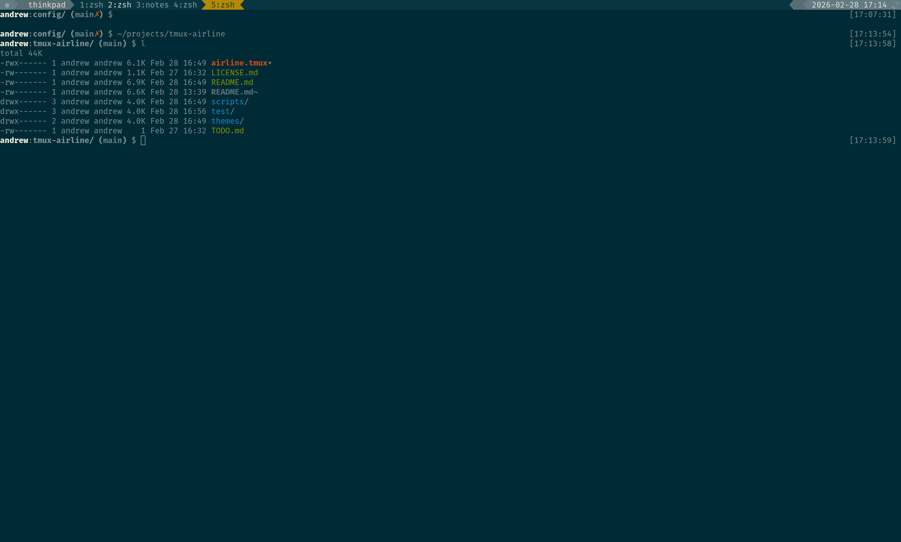

# tmux-airline

A tmux status line inspired by vim-airline. Powerline-style chevrons, a layered
color hierarchy, swappable palettes, and a small CLI that lets plugins and your
own config drive the bar.

<p align="center">
  
</p>

Features:

- Three-tier status bar with powerline chevrons
- Swappable color **palettes** (dark, light, Solarized) — or your own
- Composable **layouts** that arrange the bar, plus a CLI to drive segments and
  per-window badges
- **Adapters** that recolor tmux-cpu, tmux-battery, tmux-online-status, and
  tmux-prefix-highlight from the active palette
- Discoverable process **runner catalogs** with exit classifiers, stream filters,
  state probes, named run/watch compositions, and pane/window placement
- Session-wide widget **problems**, reduced to one extreme-right warning with
  full diagnostics available through the CLI
- Suspend/resume for nested tmux sessions

## Installation

This plugin requires **tmux 3.0+** and Bash 4+ (for associative arrays), and
has no other external dependencies. It is tested on tmux 3.4 and uses tmux
features available from 3.0 onward.

> **tmux 3.0** is needed for the format comparison operators (`#{==:…}`,
> `#{?…}` over user options) that drive the per-window entry color and the
> badge/segment rendering. On older tmux the status line will not render
> correctly.

### With [Tmux Plugin Manager](https://github.com/tmux-plugins/tpm) (recommended)

Add to `.tmux.conf`:

```tmux
set -g @plugin 'andrewjstryker/tmux-airline'
```

Press `<prefix> + I` to install.

### Manual

```shell
git clone https://github.com/andrewjstryker/tmux-airline ~/clone/path
```

Add to the bottom of `.tmux.conf`:

```tmux
run-shell ~/clone/path/airline.tmux
```

Then reload:

```shell
tmux source-file ~/.tmux.conf
```

`airline.tmux` initializes the plugin and exposes the `airline` CLI. It binds
**no keys** — you wire your own where needed (see *Nested sessions* below).

### Put `airline` on your PATH

From the plugin directory, install its small launcher into `~/.local/bin`:

```shell
make install
```

Ensure `~/.local/bin` is on your `PATH`. To use another location, set `PREFIX`
or `BINDIR`:

```shell
make install PREFIX="$HOME"
make install BINDIR="$HOME/bin"
```

The launcher finds the active plugin through tmux, so it keeps working if TPM
moves the plugin directory. Tmux-airline must be initialized in the tmux server;
otherwise the launcher prints an actionable error. The same install places Bash
and Zsh completions under the prefix's standard `share` directories. Your shell
or completion manager must include those directories in its normal completion
search path.

## Core concepts

Five things, driven by one `airline` CLI:

| Concept     | What it is                                                        | You change it with            |
|-------------|-------------------------------------------------------------------|-------------------------------|
| **palette** | The colors — a set of named roles (`inner-bg`, `active`, `ok`, …) | `palette use`, or `set -g`    |
| **segment** | One powerline block's content, in a fixed slot                    | a layout, or `set -g`         |
| **layout**  | A composition that fills the slots (and picks adapters)           | `layout use`                  |
| **adapter** | A bridge that paints a third-party plugin from the palette        | `layout` (or `adapter use`)   |
| **runner**  | An ephemeral run/watch composition over monitoring primitives     | `runner run`, `runner watch`  |

Choose a palette for the colors and a layout for the arrangement. To change an
individual palette role or segment slot, set a global tmux option and run
`airline session apply`. Airline copies that input into the invoking session's private
configuration. Plugins and widgets can use status, health, and problem signals
to report live state without rebuilding the bar.

## Nested sessions (suspend/resume)

When running tmux inside tmux (e.g., a local session SSH'd into a remote one),
every layer looks identical and keystrokes only reach the outer session.
`airline session toggle` suspends the outer session:

- The outer prefix is disabled and keystrokes pass through to the inner session
- The outer status bar dims to a flat, muted palette so you can tell which
  layer is active

airline binds no keys itself; bind your own, using the published CLI handle so
it works wherever airline is installed. Because `suspend` switches tmux's
`key-table` to `off`, bind the toggle in **both** the `root` table (fires while
active) and the `off` table (fires while suspended), so one key round-trips:

```tmux
bind -T root F12 run "#{@airline-cli} session toggle"
bind -T off  F12 run "#{@airline-cli} session toggle"
```

Inspect the current state with `airline session show state` (`active` | `suspended`).

## Palettes

A palette is a set of named color **roles**. The bar, badges, and window colors
all reference roles, never raw colors — so swapping the palette recolors
everything at once.

### Backgrounds — the three chevron tiers

| Role        | Where                          |
|-------------|--------------------------------|
| `outer-bg`  | Left/right edge blocks         |
| `middle-bg` | The blocks one step in         |
| `inner-bg`  | Window list / center           |

### Content colors — text by visual weight

| Role         | Used for                      |
|--------------|-------------------------------|
| `secondary`  | Default / low-priority text   |
| `primary`    | Normal text                   |
| `emphasized` | Section labels, active text   |

### Semantic roles — color by meaning

| Role       | Meaning                        |
|------------|--------------------------------|
| `active`   | Current window, active pane    |
| `special`  | Clock, special modes           |
| `ok`       | Success / completion (green)   |
| `alert`    | Activity, degraded (amber)     |
| `stress`   | Bell, critical (red)           |
| `zoom`     | Zoomed pane indicator          |
| `copy`     | Copy mode indicator            |
| `monitor`  | Monitor mode indicator         |

`ok`/`alert`/`stress` form a green/amber/red triad. `ok` is for **discrete
success** (a job or agent that *finished well*) — a meter's "good" state is just
the normal baseline, so only event-based signals have a distinct "succeeded"
state to paint green.

### Choosing and overriding a palette

Airline ships several palettes and picks `default` on first run. Switch with
`palette use` — it reloads the colors and re-applies the bar:

```tmux
airline palette use dark
```

| Palette           | Description                                     |
|-------------------|-------------------------------------------------|
| `default`         | Airline's shipped look (256-color dark)         |
| `dark`            | Neutral dark, explicit 256-color codes          |
| `light`           | Neutral light, explicit 256-color codes         |
| `solarized-dark`  | Solarized dark (assumes a Solarized terminal)   |
| `solarized-light` | Solarized light (assumes a Solarized terminal)  |

`airline palette list` lists what's on the search path; `airline palette
show` prints the active palette and every role; `airline palette show name`
prints just the active name (for scripts).

Change individual roles with normal global tmux options, then apply them:

```tmux
set -g @airline-active "colour214"
set -g @airline-stress "colour196"
airline session apply
```

`apply` copies each explicitly set global role over the invoking session's private
snapshot. This is a manual edit, so `palette show name` becomes empty. Unsetting the
global option later stops it from being copied again; it does not reconstruct an
older palette value. Use `palette use <name>` again when you want the complete named
palette back. A named palette selection itself affects only the invoking session and
does not rewrite the global options.

A custom palette is a tmux file containing
`set-option @airline-<role> <color>` lines; `layouts/palettes/default` is a complete
example. Put the file in a directory, register that directory, and select the
palette by filename. A registered name shadows a shipped one:

```tmux
airline palette register ~/.config/airline/palettes
airline palette use my-palette
```

## Segments and layouts

The bar is the **window list** in the center, flanked by a left and a right
**segment stack**. There are six fixed slots — three per side — and the powerline
**tier** (which background, hence the depth gradient) is baked into each slot
name, so the gradient is automatic:

```
┌──────────┬──────────┬─────────┬──────────────┬─────────┬──────────┬──────────┐
│ left-out │ left-mid │ left-in │ window list  │ right-in│ right-mid│ right-out│
│ (outer)  │ (middle) │ (inner) │  (inner-bg)  │ (inner) │ (middle) │ (outer)  │
└──────────┴──────────┴─────────┴──────────────┴─────────┴──────────┴──────────┘
   ←────────── left stack ──────────→          ←────────── right stack ──────────→
```

| Slot        | Side  | Tier   |
|-------------|-------|--------|
| `left-out`  | left  | outer  |
| `left-mid`  | left  | middle |
| `left-in`   | left  | inner  |
| `right-in`  | right | inner  |
| `right-mid` | right | middle |
| `right-out` | right | outer  |

A segment's content is a normal tmux format string. You set it directly and
re-apply — the CLI reads segments back but does not write them:

```tmux
# put the kubectl context in the right-inner slot
set -g @airline-segment-right-in '#[fg=colour39]⎈ #(kubectl config current-context)'
airline session apply

# inspect the slots (bare = all, or name one)
airline segment show
airline segment show right-in
```

### Layouts

Usually you don't set slots by hand — a **layout** does. A layout is a script
that fills the slots (and turns on the matching adapters) as one composition.
`layout use` runs it once, captures its slots and adapters, and records it. A later
palette change repaints the recorded adapters without rerunning the layout script;
plain `apply` copies global edits and renders the committed arrangement:

```tmux
airline layout use minimal
airline layout show          # the active layout + its file
airline layout list     # what's on the layout path
```

| Layout     | What it composes                                                    |
|------------|---------------------------------------------------------------------|
| `adaptive` | Init's default — probes installed plugins, composes only what's present, degrades to session + date |
| `default`  | The standard full arrangement                                       |
| `full`     | Every slot populated                                                |
| `minimal`  | A pared-down bar                                                    |

Switching layouts starts from a clean slate, so a layout owns exactly the arrangement
it declares. A layout is trusted Bash with one required function. The function uses
its callback argument to declare segments and adapters:

```bash
airline_layout_configure () {
  local declare="$1"
  "$declare" segment left-out '#S'
  "$declare" segment right-mid '#{cpu_fg_color}#{cpu_icon}'
  "$declare" adapter use cpu
}
```

Airline validates the whole declaration before replacing private layout state.
Unknown or duplicate slots, invalid adapters, nested Airline commands, and stdout
are errors. Omitted slots are intentionally empty. Put the file in a registered
layout directory and select it by filename. A failed selection preserves the last
committed layout and raises the session's `airline-layout` problem; a successful
layout selection clears it.

The **window-list entry** itself is fixed as `#I:#W` (index:name) and styled by
the window colors below rather than configured as a segment.

## Plugin adapters

An **adapter** teaches a third-party plugin to draw in airline's palette. It's a
small snippet that sets the plugin's own color options from the active palette —
so tmux-cpu, tmux-battery, and friends match the bar and recolor whenever the
palette changes. Adapters ship for:

| Plugin                 | Adapter          | Slot it usually fills |
|------------------------|------------------|-----------------------|
| tmux-online-status     | `online`         | `left-mid`            |
| tmux-prefix-highlight  | `prefix-highlight` | `right-in`          |
| tmux-cpu               | `cpu`            | `right-mid`           |
| tmux-battery           | `battery`        | `right-out`           |

The `adaptive` layout detects which of these are installed (by directory name in
the plugin folder) and wires up only those — an uninstalled plugin leaves its
slot empty (the block collapses to just its background). airline only sets the
plugin's colors; the plugin draws its own widget.

You rarely call adapters directly — a layout invokes them — but you can:
`airline adapter use cpu`, `airline adapter show` (what's applied), `airline
adapter list` (what's on the path).

## Process runners

Interactive programs with lifecycle hooks should call airline's `status` and
`health` API directly. A runner is the lower-fidelity floor for non-interactive
lifecycles: `run` launches a command, while `watch` polls external state without
requiring a placeholder local job.

Airline ships `basic` as the implicit classifier, `tap` as a stream filter, and
`http` as a probe. Each is a first-class catalog with its own discovery commands:

```sh
airline classifier list
airline classifier show basic
airline filter show tap
airline probe show http
```

Elements compose only for one invocation:

```sh
airline runner run -- make test
airline runner run --pane -- npm test
airline runner run --pane -h -- npm test
airline runner run --window -- cargo test
```

The default `--here` runs synchronously in the current pane, streams terminal I/O,
and returns the command's original exit status. `--pane` and `--window` launch in
new tmux topology and print the new pane id. After `--pane`, the native tmux `-h`
and `-v` modifiers select the split orientation; bare `--pane` keeps tmux's default.
Spawned panes are retained after exit so their output and native tmux exit status
remain available until dismissed.

A probe-only implementation can watch a remote service until interrupted:

```sh
airline runner watch --probe http http://localhost/health
airline runner watch --window --probe http endpoint1 endpoint2
```

Frequently used compositions can be named. Airline ships `tap` as a run
composition and `http` as a watch composition:

```sh
airline runner list
airline runner show tap
airline runner run tap -- bats --formatter tap test/
airline runner watch http http://localhost/health
```

A runner catalog entry contains monitoring configuration, never the command. It is
expanded for that invocation and does not become active session state. With no
arguments, the shipped `http` runner checks
`http://localhost/health/live` and `http://localhost/health/ready`; supplied
endpoints replace those defaults.

While watching, status is `active` and probe reports drive health. Stopping the
watch clears both; there is no artificial command exit to classify.

`--here` is the explicit spelling of the default placement; `--pane [-h|-v]` and
`--window` are alternatives. Probe arguments continue to end-of-argv for `watch`.
For `run`, the bare `--` separates the airline specification from the command.

This lifecycle monitoring is independent of tmux's standard terminal monitoring.
Airline observes a process it runs: whether it is active, its changing health, and
how it exits. Tmux observes the containing terminal: activity, silence, and bells.
The signals may overlap in directing attention to a window, but neither implies or
configures the other. Users may invoke either system alone or combine them; runner
placement never changes `monitor-activity`, `monitor-silence`, or `monitor-bell`.

While a command runs, its window reports status `active`. On exit, airline maps the
runner's normalized result onto its existing channels:

| Result | Status | Health |
|--------|--------|--------|
| `ok` | `result` | clear |
| `warn` | `attention` | `warn` |
| `fail` | `attention` | `fail` |

Completion signals are transient. A command explains itself in its pane; airline
does not rewrite the command or manufacture another description. A selected filter
may interpret a copied output stream solely to project live health.

### Runner elements

Runner elements are trusted shell files in independently registered classifier,
filter, and probe catalogs; shipped examples live under `runners/`. `run` uses the
`basic` classifier unless an explicit `--classify` is supplied. A classifier looks
like:

```bash
AIRLINE_CLASSIFIER_SUMMARY='Interpret pytest termination'

airline_runner_classify() { # <exit-status> <signal>
  case "$1" in
    0) printf 'ok\n' ;;
    5) printf 'warn\n' ;; # for example, pytest collected no tests
    *) printf 'fail\n' ;;
  esac
}
```

Register an implementation in its corresponding catalog, then compose one invocation:

```sh
airline classifier register ~/.config/airline/classifiers
airline runner run -- pytest
airline runner run --classify pytest -- make test
```

A filter receives a tee'd copy of stdout by default. `--merge-stderr` applies
ordinary `2>&1` semantics before the tee:

```bash
AIRLINE_FILTER_SUMMARY='Interpret top-level TAP output'

airline_runner_filter() { # <pid> <report-function>
  local pid="$1" report="$2"
  while IFS= read -r line; do
    # Interpret line, then report ok | warn | fail; later ok reports recovery.
  done
}
```

Airline ships `tap` as the filtering example. It warns when a
top-level TAP assertion fails, fails when the unsuccessful plan completes or the
stream bails out, and leaves TODO/SKIP failures alone:

```sh
airline runner run --filter tap -- bats --formatter tap test/
```

A long-lived process can instead define a probe when an API or other state source
contains useful current information absent from its logs:

```bash
AIRLINE_RUNNER_PROBE_INTERVAL=5
AIRLINE_PROBE_SUMMARY='Check service health endpoints'
AIRLINE_PROBE_USAGE='<endpoint> [<endpoint>...]'

airline_runner_probe() { # <lifecycle-pid> <report-function> [<arg>...]
  local pid="$1" report="$2"
  # Make one bounded query, write useful results to stdout, and call:
  # "$report" ok|warn|fail
}
```

Probe stdout is uninterpreted user output. Airline writes it to the pane but never
parses it; formats such as `ok 204 <endpoint>` are conventions implementations may
adopt, not part of the protocol. Health observations travel only through the
reporter callback. During `run`, probe stdout bypasses the command-output tee, so a
selected filter sees only command output. During `watch`, probe stdout supplies the
visible polling transcript.

The shipped `http` probe checks one or more endpoints uniformly:

```sh
airline runner watch --probe http \
  http://localhost/health/live \
  http://localhost/health/ready
```

The equivalent shipped named composition is shorter:

```sh
airline runner watch http \
  http://localhost/health/live \
  http://localhost/health/ready
```

At least one URL is required. For each endpoint the probe writes its condition,
HTTP status, and URL to stdout. Each 2xx response reports `ok`; every other response
or connection failure reports `fail`. Airline ignores the displayed text and
reduces the callback reports to the worst condition. Each request has a two-second
connection timeout and a five-second total timeout. Missing `curl` or invalid
arguments use the problem API.

Airline runs one probe at a time, schedules the next after the interval, and stops
on process exit (`run`) or interruption (`watch`). It validates observations and
projects filter and probe health independently. The probe owns timeouts and domain
semantics; airline does not add persistence, restart policy, or general job
management. A probe that exits nonzero, calls no reporter, or reports an invalid
value creates a problem until a valid observation recovers it. Under `watch`, the
PID argument identifies the local watcher lifecycle, not the remote service.

### Named runner compositions

Runner definitions are trusted shell files in an independently registered catalog;
shipped definitions live in `runners/definitions/`. Two required functions build a
validated composition:

```bash
airline_runner_metadata() { # <declare-function>
  local declare="$1"
  "$declare" summary 'Monitor a TAP-producing test command'
  "$declare" usage ''
}

airline_runner_configure() { # <configure-function> [<runner-arg>...]
  local configure="$1"; shift
  "$configure" classify basic
  "$configure" filter tap
}
```

The metadata callback accepts `summary` and `usage`. The configuration callback
accepts `classify`, `filter`, and `probe` declarations, validates their
arity and cardinality, and preserves probe arguments as argv. It cannot specify `--`
or a command. Unexpected callback fields, duplicates, or stdout make the definition
invalid.

```bash
"$configure" classify <name>
"$configure" filter <name> [merge-stderr]
"$configure" probe <name> [<arg>...]
```

Arguments supplied after a named runner are passed to its configuration function.
A definition can therefore provide defaults while allowing replacements. `run` uses
the complete configuration; `watch` uses only the probe, failing when the runner has
none. Placement remains an option on the `run` or `watch` invocation and cannot be
stored in a runner. There is no runner mode or separate watcher definition.
Register and inspect compositions like every other catalog:

```sh
airline runner register ~/.config/airline/runners
airline runner list
airline runner show my-tests
```

A plugin that already owns richer scheduling or callbacks may instead call the
health API directly. That is an alternative to `watch`, not a distinction based on
whether the observed service is local or remote.

## Window list signals

### Targets and scope

Airline maps its state onto tmux's normal scopes:

- Options set with `set -g @airline-*` are server-wide input, copied by a later
  configuration operation into that operation's session.
- The committed palette, segments, layout, and adapters are private to the invoking
  session and are read through the CLI.
- Session-public options written while evaluating palette/layout files are cleared;
  they are not another user configuration scope.
- Status and health belong to a window; `-t` accepts a pane or window target.
- Problems belong to a session; background jobs should pass `-t <session>`.

A window entry has three layers, owned by two parties. **airline** owns the
entry's *color* (the name itself); **plugins** speak through two *badges* that
flank the name. They never collide.

```
 ○ 1:vim        ● 2:build ▲        ◆ 3:agent
 │   └name      │   └name  └health   │   └name
 └status        └status              └status  (needs you)
```

The **status badge** sits *left* of the name; the **health badge** sits *right*.
Because they're on opposite sides, their colors may overlap without ambiguity.

### Entry color (airline-owned): tmux modes

The window name's color is airline's alone — no plugin API. It reflects, in
order, **tmux modes** over the **baseline** (focused / last / normal):

| State                              | Color     |
|------------------------------------|-----------|
| A pane in the window is **zoomed** | `zoom`    |
| The active pane is in **copy mode**| `copy`    |
| `monitor-activity` is **on**       | `monitor` |

Precedence is **zoom > copy > monitor**. With no mode, the normal focused, last,
activity, and bell styling applies.

### Badges (plugin-owned): the `airline` CLI

Plugins drive badges through the **`airline` command** — the supported API. It
owns the underlying tmux options and validates input, so plugins never depend on
option-name conventions.

> **Finding the CLI.** airline publishes its own path in the `@airline-cli`
> tmux option on load, so a cooperating plugin never has to guess the install
> location:
>
> ```shell
> airline="$(tmux show -gqv @airline-cli)"
> [ -n "$airline" ] && "$airline" status set agent active
> ```
>
> The empty check doubles as an "is airline installed?" probe.

**Status** (left) — a window's app-status, at one of three levels. Many
contributors can report under their own keys; airline shows the highest-ranked
one:

```tmux
airline status set build active      # ○ watching  (amber)
airline status set build result      # ● finished well (green) — outranks active
airline status set build attention   # ◆ needs you (amber)
airline status clear build
airline status show                  # keys + current values
```

Levels are `active` / `result` / `attention`; `result` outranks `active`. A
window with no status contributor shows nothing.

**Health** (right) — a single condition glyph reduced from any number of
contributors; airline shows the **worst**. `ok` (or no contributor) shows
**nothing** — a clean right side means healthy:

```tmux
airline health set ctx fail          # ▲ broken (red)
airline health set build warn        # △ degraded but running (amber)
# badge now shows one glyph at the worst level (fail)
airline health set ctx ok            # recovery clears ctx; drops to warn
airline health show                  # contributors + reduced result
```

Health and problem share the levels `ok < warn < fail`. `ok` means normal and
clears that contributor, so it is equivalent to `clear <key>`. `warn` means the
component degraded gracefully and can keep working; `fail` means it could not
recover and is broken. `warn` uses the palette's amber `alert` role; `fail` uses
its red `stress` role. Glyphs are fixed (a distinct shape per visible state, so
badges stay legible without color). All badge commands accept `-t <target>` to
act on a window other than the current one.

**Consume-on-view (`--transient`).** By default the setter owns clearing — a
badge stays until something clears it. For a state whose setter can't observe
that you've *seen* it (a finished job, an agent waiting for input), set it
`--transient` and airline clears it once you've viewed the window and moved on:

```tmux
airline status set agent result --transient   # clears when you leave the window
airline health set build fail --transient
```

Transient signals clear after you leave the window; sticky ones are untouched.

Because color and badges live on different layers, a window can show a mode
color, a health glyph, and a status glyph all at once without contention.

## Session problems

An airline-aware widget can fail gracefully and report why through the
session-scoped `problem` API. Problems are keyed contributors with a level
and message. Airline retains every contributor for inspection, reduces them
with the same `ok < warn < fail` model as health, and shows one aggregate glyph
at the extreme right. The concept is the same; only the scope differs: health
belongs to a window, while problems belong to a session. No problems renders
nothing, and setting a problem to `ok` clears it without requiring a message.

```shell
# Invoke the widget from a tmux format as: #(my-widget '#{session_id}')
session="${1:?widget requires its tmux session id}"

if ! command -v sensors >/dev/null 2>&1; then
  airline problem set "$session" cpu warn "required program 'sensors' was not found"
  printf '?'
  exit 0
fi

airline problem clear "$session" cpu
```

Several widgets may report independently; clearing the worst problem naturally
downgrades the aggregate to the next level. Mutations require their session as
the first argument and never propagate through linked windows. Two sessions may
encounter and clear the same underlying problem independently.

Bare `problem show` lists problems from every session, grouped by canonical
session id. `problem show <session>` narrows the listing, and `problem show
<session> <key>` returns one problem as a raw, tab-delimited
`level<TAB>message` tuple. Tmux status formats can supply the precise evaluation
context as `#{session_id}`; callers do not need to infer it from `TMUX_PANE`.

### Lock recovery

Airline serializes collection updates with owner-scoped tmux locks. A process
killed with `SIGKILL` cannot run cleanup, so its lock can remain behind. The lock
diagnostics make that rare state discoverable and recoverable:

```shell
airline lock show
# scope<TAB>owner<TAB>namespace<TAB>active|stale<TAB>pid<TAB>age-seconds

airline lock clear session '$1' problem
airline lock clear window '@3' status
```

`lock clear` only releases a stale lock; it refuses to clear one whose recorded
owner process is still alive. Lock recovery is separate from the problem API so
diagnosing a stuck problem transaction never depends on acquiring that same lock.

## The `airline` CLI

One entry point drives everything. Public commands use a noun followed by a verb;
help and the remaining internal runner continuations are the only exceptions. `-t`
targets a window for status/health and a session for targeted initialization.
Problem mutations instead take their owning session as a required first argument.

```
airline session init [-t <session>]  # initialize the current or selected session
airline session apply                # commit global edits and render
airline session show [state]         # print the configuration or raw session state
airline session suspend | resume | toggle
airline help [noun [verb]]    # all commands, one noun, or one leaf command

airline palette  show [name|<palette-element>] | list | use <palette> | register <dir>
airline segment  show [<segment>]              # read-only; write with set -g @airline-segment-<segment>
airline layout   show [name|path] | list | use <layout> | load <file> | register <dir>
airline adapter  show | list | use <adapter>... | load <file> | register <dir>
airline classifier show <classifier> | list | register <dir>
airline filter     show <filter> | list | register <dir>
airline probe      show <probe> | list | register <dir>
airline runner   show <runner> [<arg>...] | list | register <dir>
                 run [--here|--pane [-h|-v]|--window] [<runner>] [--classify <classifier>]
                     [--filter <filter> [--merge-stderr]] [--probe <probe> [<arg>...]] -- <command>...
                 watch [--here|--pane [-h|-v]|--window] [<runner>] [--probe <probe> [<arg>...]]
airline status   set <status-key> <active|result|attention> [--transient] [-t <window>] | clear <status-key> [-t <window>] | show [<status-key>] [-t <window>]
airline health   set <health-key> <ok|warn|fail> [--transient] [-t <window>] | clear <health-key> [-t <window>] | show [<health-key>] [-t <window>]
airline problem  set <session> <problem-key> <ok|warn|fail> [<message>] | clear <session> <problem-key> | show [<session> [<problem-key>]]
airline signal   clear-transient [-t <window>]
airline lock     show | clear <session|window> <target> <namespace>
```

Two conventions run through it:

- **`use` vs `register`.** `use <name>` loads a bare configuration name from a
  registered directory; `register <dir>` adds one (and lets it shadow shipped
  names). `load <path>` runs a one-off adapter or layout file. Classifier, filter,
  probe, and runner each have an independent registered catalog.

- **`show`.** Bare `show` is a human summary; `show <field>` prints one raw
  value, newline-terminated, safe for `$(…)`. `list` lists the catalog a
  `use` can pick from. Catalog-only runner nouns instead use `show <name>` for an
  implementation's summary, usage, and path. Editing a color or segment option is
  free; the bar re-renders on the next `session apply` (or `use`, which ends in one).

Help is inspected through the top-level command, for example `airline help
palette` or `airline help runner run`. Bash and Zsh completion follows the same
grammar and completes typed values such as palette, layout, probe, session, and
window names through the installed CLI.

## Development

For the architecture, internal boundaries, design rationale, and testing strategy,
see [DESIGN.md](DESIGN.md).

The full suite still exercises real isolated tmux servers:

```shell
make test
```

For focused development, `make test-fast` runs only static and in-memory behavior
tests. `make test-layout`, `make test-lifecycle`, and `make test-runner` pair tests
with the corresponding `lib/` module; `make test-integration` runs every real-tmux
suite. Run `make lint` for ShellCheck and the architecture guards.
