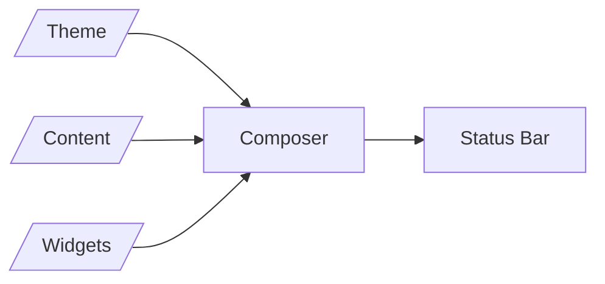

# Core Benefits

Tmux Status brings the concept of _composibility_ to building a Tmux status
bar. Thus, users can mix and match theme, status bar content, and widgets.

Tmux's native mechanism for customizing the status bar is limited. Tmux allows
users to set `status-left`, `status-right`, and friends. Tmux reads these
variables to build the status bar. The interface does not provide mechanisms
for:

  * Defining a theme or color palette

  * Separating content (*"the what"*) from the aesthetics (*"the how"*)

As a result, users are not able to keep separate themes and content configuration.
For example, browse the code the [Tmux
Themepack](https://github.com/jimeh/tmux-themepack) project. The project
defines three status bar configurations, each in nine colors, for a total of
27 of files. By separating styling and content, this plugin allows you to achieve
the same result with three content definitions and nine color themes, for
a total of twelve files. This simplifies maintenance.

The **tmux-status** plugin addresses these limitations by providing an
interface for:

  * Setting color themes

  * Defining status bar components

  * Setting the content of components

  * Applying the color theme to each component
