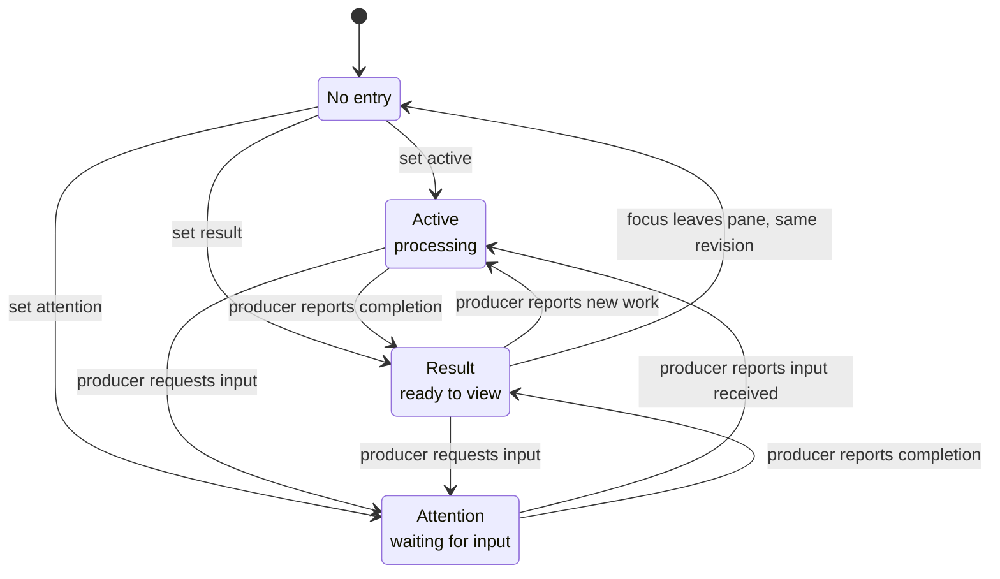
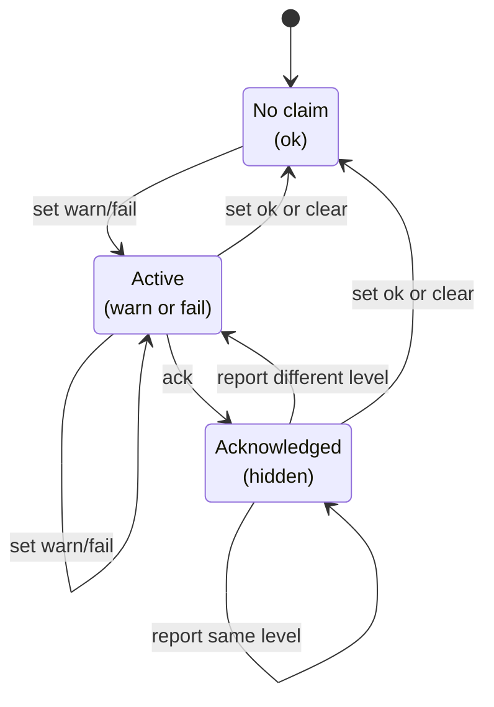
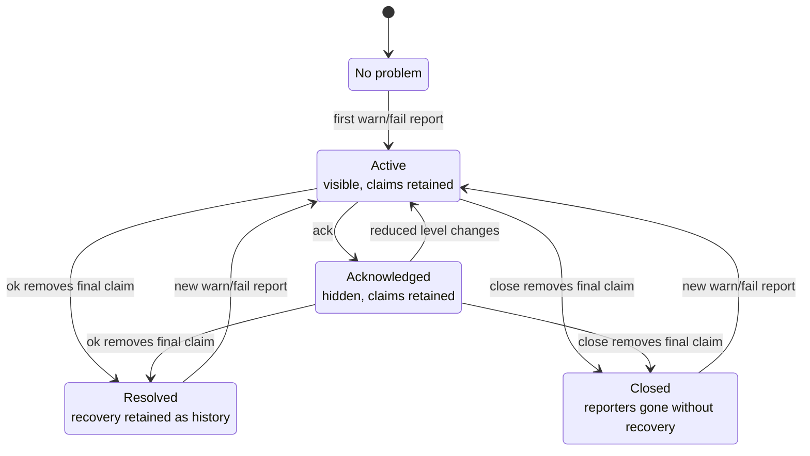

# Signal lifecycles

Airline signals let a contributor expose retained state in the tmux window list.
They are not interchangeable notification styles. Each channel answers a different
question:

- **Status:** what is happening in this window that the user may want to inspect?
- **Health:** what observed condition is currently unhealthy in this window?
- **Problem:** what advertised capability can Airline or a contributor currently
  not provide?

The interfaces are deliberately coherent. Contributors set named state, normal
state is invisible, repeated reports are safe, and the most important current value
is projected into one badge. `clear` deletes retained state, `ack` hides retained
health or problem state without claiming recovery, and `show` inspects it. The exact
result still follows the meaning of each channel: status advances according to its
workflow phase, health may retain an acknowledged condition, and problem retains a
lifecycle ledger.

Problem is expected to be the least frequently used signal and has the richest
lifecycle. That complexity is justified by its meaning: a problem says that a
component cannot fulfill its contract, and it is visible server-wide. Airline must
not mistake acknowledgement or the disappearance of a reporter for demonstrated
recovery.

Signal choice follows meaning, not severity. A failed test or unreachable service
can be a `fail` health condition without becoming a problem. It becomes a problem
only when the contributor itself cannot provide the capability it advertises—for
example, because a required executable is unavailable.

## At a glance

| Signal | Meaning | Identity and scope | Values | Retention | Commands |
|--------|---------|--------------------|--------|-----------|----------|
| Status | The workflow phase of work whose details are visible in the pane | pane within one window | `active`, `result`, `attention` | Active work and input requests persist until the producer updates them; observed results are deleted | `set`, `clear`, `show` |
| Health | A currently observed domain condition | contributor and claim key owned by one pane | `ok`, `warn`, `fail` | Active or acknowledged until recovery, clear, or pane destruction | `set`, `ack`, `clear`, `show` |
| Problem | Failure to provide an advertised capability | contributor and problem key globally, with pane or session origins | `ok`, `warn`, `fail` plus lifecycle state | Claims until recovery, close, resolve, or clear; terminal state until a new report or clear | `set`, `close`, `ack`, `resolve`, `clear`, `show` |

Status uses `active < result < attention`: ongoing work, a result to inspect, and a
request for input. Health and problem use `ok < warn < fail`. `ok` is normal and
invisible; every retained `warn` or `fail` includes a diagnostic message.

Health and problem identify contributors explicitly. A contributor is a stable
software identity, while its key names a stable condition or capability. Severity
and diagnostic text are never part of identity. A contributor mutates only its own
claims; Airline validates framing but does not attempt to authenticate ownership.

## Identity and lifecycle authority

Status identity is structural and Airline-defined. The targeted pane is the key, so
there is exactly one workflow phase per pane and a contributor reports only its
current value. Airline derives the identity from tmux, projects it to the containing
window, and owns automatic observation of `result`. The producer remains responsible
for advancing `active` processing and `attention` after input.

Health and problem claim identity is semantic and contributor-defined. A contributor
chooses a stable key for each independent condition or capability it owns; this is a
domain identifier, not an Airline-issued token. The explicit contributor identity
allows multiple reporters to use the same key without collision, while stable keys
also allow one contributor to maintain several simultaneous claims. Airline owns
their storage, reduction, acknowledgement, and presentation, but does not assign
meaning to those keys. A health claim additionally has a structural pane owner,
which supplies its runtime and user-visible origin.

Viewing a pane cannot demonstrate that a health condition recovered or that a
missing capability became available. Health and problem therefore require an
authoritative lifecycle event rather than advancing through observation. The
contributor reports current condition and recovery; problem origin hooks may record
that a reporter disappeared; and the user may acknowledge retained state without
claiming recovery.

| Signal | Identity owner | Identity | Normal transition authority |
|--------|----------------|----------|-----------------------------|
| Status | Airline, from tmux structure | pane | producer for `active` and `attention`; Airline for an observed `result` |
| Health | contributor within a pane origin | pane + contributor + health key | contributor reports condition and recovery; user may acknowledge |
| Problem | contributor | contributor + problem key globally, with pane or session origins | contributor reports condition and recovery or authoritatively resolves; hooks close origins; user may acknowledge |

## Status



From any retained status, `clear` deletes the pane entry and returns it to **No
entry**. Repeating the current phase leaves it unchanged.

Status is lightweight window-local workflow state with one entry per pane. The pane
is both its identity and its explanation: it contains the progress, result, or
interaction behind the badge. A contributor reduces any subprocesses or concurrent
tools it owns into this one user-visible pane phase rather than exposing process
identity through Airline.

The three values have different transition mechanisms. `active` means processing is
underway and remains until the producer reports a new phase. `attention` means the
workflow is waiting for input and remains until the producer observes that input.
`result` means processing has finished and its output is ready to view; observing the
window fulfills that signal's purpose. A runner's health claim separately describes
whether the completed result was `ok`, `warn`, or `fail`.

`set` creates or replaces the targeted pane's entry. Each effective set or clear
increments a revision counter owned by that pane. `show` includes every current pane
revision for general introspection.

Plain `clear` explicitly deletes the pane entry. Setting `result` also ensures that
Airline's observation hook is installed. When a pane loses focus, Airline supplies
the pane and its current revision to a private conditional operation that deletes
only that exact result revision. Other panes, `active`, `attention`, and any newer
state remain untouched. This deliberately requires the user to leave the pane before
its result is cleared; merely being visible is not treated as proof of observation.
Status has no acknowledged state or retained history after deletion. Contributors
normally advance active work and input requests themselves; they neither install the
observation hook nor handle revision tokens.

A window badge reduces all of its pane phases by user-action priority:
`active < result < attention`. Ongoing work is passive information, a completed
result is ready to inspect, and an input request blocks progress. This ordering is
presentation policy, not severity and not the order every individual workflow must
follow. Interactive processes such as coding agents are the motivating producer for
`attention`; Airline's non-interactive runner does not manufacture that phase.

## Health



Health describes a successful observation of an unhealthy domain result. The
contributor is working well enough to report what it observed; the observed system
may be degraded or failed. Examples include a failed test, an unreachable endpoint,
or a service returning an unhealthy readiness state.

Each pane owns an independent collection in which contributor and claim key identify
one condition. `set warn` or `set fail` makes the condition active and visible.
`ack` hides the current level
without asserting recovery. Repeated observations at that same level refresh its
diagnostic but remain acknowledged; a change between `warn` and `fail` is a new
semantic state and becomes active again. `show` lists active health, while `show
--all` also includes acknowledged claims.

A later `set ok` demonstrates reporter recovery and removes the claim. `clear`
deletes it directly and has the same final state, but does not itself communicate a
new observation. Health retains acknowledged current state but no terminal history:
after recovery or clear, there is no claim.

Health is never consumed merely by leaving a pane: attention says nothing about
whether the observed condition changed. The pane is the report's operational
origin—even for a remote-service probe—and provides the output or context a user can
inspect. Pane destruction removes its claims. Airline reduces every pane's visible
claims into the containing window badge and reprojects affected windows when a pane
moves or disappears.

## Problem

A problem means that Airline or a contributor cannot provide an advertised
capability. Its global visibility is separate from the scope of each report.
There are two retained objects:

| Object | Identity | Contents |
|--------|----------|----------|
| Origin claim | contributor + problem key + origin kind and ID | One pane's or session's current `warn` or `fail` observation |
| Problem record | contributor + problem key | Reduced level, diagnostic, and lifecycle state shared across origins |

Two HTTP probes using `airline-http` / `curl` in different panes contribute two
claims to **one problem record**. Different contributor names identify different
problems, even if both use the key `curl`. Claims belong to origins, not to individual
probe processes: a replacement probe in the same pane can recover that pane's claim.

`ok` is a recovery report about one origin; **resolved** is a state of the shared
record. Reporting `ok` removes only the selected origin's claim. If no such claim
exists, it creates nothing and changes nothing, even if another origin still holds
this problem. If claims remain, the record follows their reduced level. Recovery
of the final claim marks the record `resolved` and retains its last diagnostic.

### Shared record lifecycle



From any retained state, `clear` removes the record and **all its origin claims**,
returning to **No problem**. `resolve` removes all claims for that contributor/key
and marks an existing record **Resolved**, retaining its last diagnostic. Neither
operation creates a record when none exists.

While claims remain, adding, updating, recovering, or closing one origin recomputes
the shared record. An active record stays active. An acknowledged record stays
hidden while the reduced level is unchanged, including when a diagnostic changes;
a change in reduced level makes it active again. `ack` changes visibility without
removing claims or asserting recovery.

### Multiple origins

This sequence uses one contributor/key, `airline-http` / `curl`. `A` and `B` denote
pane origins; the braces show the claim set **after** each operation.

```mermaid
sequenceDiagram
    participant A as HTTP probe in pane A
    participant B as HTTP probe in pane B
    participant P as Shared problem record
    participant H as Airline lifecycle hook

    A->>P: set fail: curl missing — claims {A: fail}
    Note over P: Active, fail
    B->>P: set fail: curl missing — claims {A: fail, B: fail}
    Note over P: Active, fail
    Note over A,B: User installs curl; A checks again, B has not reported recovery
    A->>P: set ok — claims {B: fail}
    Note over P: Active, fail: B still holds a claim
    A->>P: set ok again — claims {B: fail}
    Note over P: No change: A has no claim to withdraw
    Note over B,H: Pane B exits
    H->>P: close pane B — claims {}
    Note over P: Closed: last diagnostic retained, badge hidden
```

A fresh probe in a third pane behaves like A's second `ok`: it has no claim to
withdraw and cannot recover B's observation. If B reports `ok` instead of closing,
the empty claim set produces **Resolved**. An explicit `resolve` also produces
**Resolved**, removing every remaining claim for this problem at once.

### Targets and lifecycle authority

Public `problem set` is pane-only, defaults to the current pane, and accepts `-t`
for another pane. Core palette and layout evaluation reports create session claims
through the internal signal service; the CLI cannot create session claims.
Successful configuration evaluation recovers only the session origin it evaluated.

`problem close [-t <pane-target> | --session <session-target>]` defaults to the
current pane. Omitting contributor and key closes **every claim at that origin**;
omitting only the key closes that contributor's claims there. This sweep is also
used by the pane-exited, pane-died, and session-closed hooks installed during session
initialization. It does not remove claims at other origins. The final disappearing
claim leaves `closed` history: reporting stopped without demonstrating recovery.

Use `set ... ok` when recovery is known for the selected pane. Use `resolve` when
the contributor or user can establish recovery for the entire problem identity.
Finding curl in one pane's environment is enough to withdraw that pane's claim;
it does not by itself establish that every other reporting environment has recovered.
`ack` is never a recovery assertion, and `close` is never proof of recovery. Use
`clear` when the retained lifecycle itself should be discarded.

`show` lists active, visible problems. `show --all` includes active, acknowledged,
closed, and resolved records together with any current origins. The ledger retains
the current lifecycle state and last diagnostic, not an append-only event log: a
new failure report reopens and replaces a closed or resolved terminal state.
